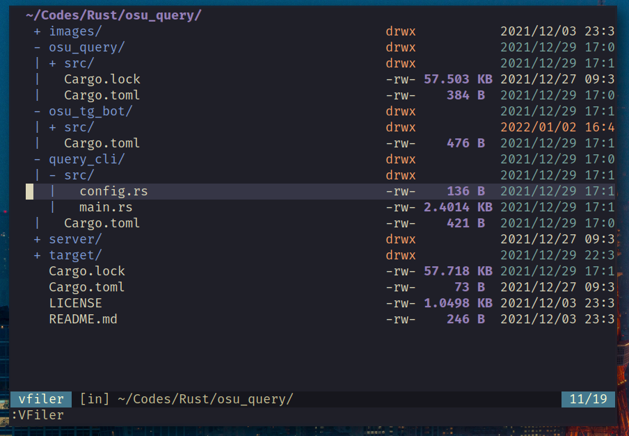
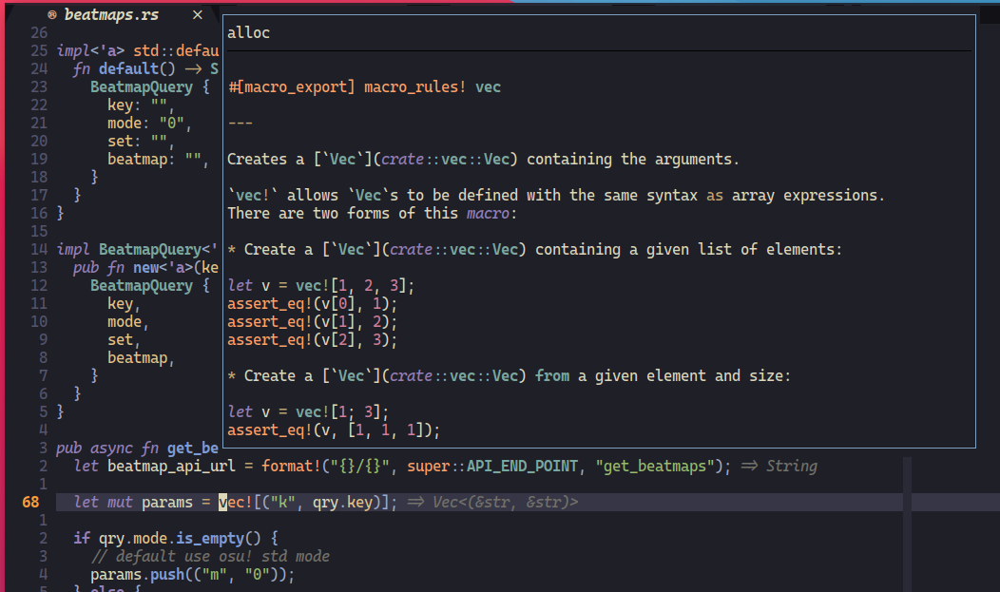
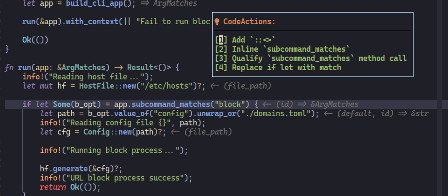
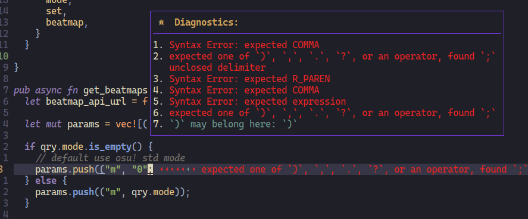

++++
<h1 align="center">My Neovim Configuration</h1>

++++

link:#more-screenshot[image:https://img.shields.io/badge/More%20Screenshot-click-blueviolet?logo=googlephotos[badge]]
image:https://github.com/avimitin/nvim/actions/workflows/test.yml/badge.svg[badge]
image:https://github.com/avimitin/nvim/actions/workflows/lint.yml/badge.svg[badge]
image:https://img.shields.io/badge/Language-Lua-blue?logo=lua&logoColor=blue[badge]
image:https://img.shields.io/github/contributors/Avimitin/nvim?color=dark-green[badge]
image:https://img.shields.io/github/issues/Avimitin/nvim[issue]
image:https://img.shields.io/github/license/Avimitin/nvim[license]
image:https://img.shields.io/github/forks/Avimitin/nvim?style=social[badge]
image:https://img.shields.io/github/stars/Avimitin/nvim?style=social[stargazer]

== Motivation

I want a text editor which:

* Really really fast. I don't need to care I will have to spend seconds or minutes on
opening a text file. (See link:./utils/benchmark.txt[`benchmark`])
* Really really powerful. I can use it to learn all the programming languages. I don't
need to install IDE per language.
* Really really handy. I don't need to move my hand to my mouse. I don't need to click
the keyboard too much. I can have my cursor in place at the moment my eye first skim.
* Really really beautiful. I can treat it as a work of art, not a tool.

== Getting Start

I recommend you use my configuration as a base and build your
configuration. In my opinion, everyone should have their customized
neovim. You can press the fork button to clone my project. (Don't forget
to smash the star button! :) )

=== Docker

Just wanna have a try but do not want to mess up your local environment?
I have docker script for you!

[source,bash]
----
docker run -w /root -it --rm alpine:edge sh -uelic '
      apk add git neovim ripgrep alpine-sdk --update
      git clone https://github.com/Avimitin/nvim ~/.config/nvim
      nvim -c "autocmd User PackerComplete quitall"
      nvim /root/.config/nvim/README.md
  '
----

=== Prerequisites

* *Neovim* (MUST)

Currently I am using `NVIM v0.7.0-dev+808-g838631e29e`. If you got any
error, please check your neovim version.

You can follow https://github.com/neovim/neovim/wiki/Installing-Neovim[neovim
installation] to build latest neovim.

If you are Arch Linux user, you can simply run: `yay -S neovim-git`

* *Nerdfont* (MUST)

Most of my setting are based on nerd font. It’s highly recommended to
install https://www.nerdfonts.com/font-downloads[nerdfont] for
impressive icon support.

* *ripgrep* (MUST)

The telescope, nvim-cmp, and anyjump plugin are configured to use ripgrep
as the search program. It is an faster grep RIIR alternative.

See its https://github.com/BurntSushi/ripgrep[readme] for more.

* *Surf* (OPTIONAL)

I am using https://surf.suckless.org/[Surf] as my markdown preview
browser. Firefox is too heavy for the preview job. If you have interest
on it, please follow the instruction from the official pages. If not,
you can easily modify the settings:

[source,sh]
----
sed -i 's/surf/firefox/g' ./lua/config/mkdp.lua
----

How to build surf::

[source,sh]
----
# Arch linux contains most of the library
# Other distro need to check out documents yourself
git clone https://git.suckless.org/surf
cd surf
sudo make clean install
----

=== Installation

[source,bash]
----
# NO WINDOWS SUPPORT NOW
git clone https://github.com/YOUR_USER_NAME/nvim ~/.config/nvim
----

Open your neovim by command `nvim` and wait for all plugins installed.
The plugins will be installed automatically. Please quit and reopen the
neovim to load all the plugins.

____
If the neovim don’t install plugins automatically, use the command
`:PackerSync` to install those plugins manually. And please open a issue
to notify me about the error.
____

*NOTE:* Markdown preview plugin is installed in another thread, please
wait for it until it response message of installation success.
Otherwise, you will find that you can’t activate it.

'''''

If you want a minimal vimrc, use this:

[source,bash]
----
# it is not tested yet, feel free to open issues
curl -SL "https://raw.githubusercontent.com/Avimitin/nvim/master/.vimrc" -o ~/.vimrc
----

=== How to clean the plugin and reinstall

You need to clean the below directory for a fresh install.

[source,bash]
----
# plugins directory
rm -rf ~/.local/share/nvim

# neovim cache file
rm -r ~/.cache/nvim

# neovim plugins load sequence
rm -r ~/.config/nvim/plugin
----

=== Check health

Open your neovim and input following command to check if the dependence
is all installed or not.

[source,vim]
----
:checkhealth
----

== Details about my configuration

See https://avimitin.github.io/nvim[document(WIP)].

== License

MIT License

== Credit

This project is originally inspired by
https://github.com/theniceboy/nvim[theniceboy/nvim].

And lua code is inspired by
https://github.com/siduck76/NvChad[siduck76/NvChad].

Take a look at their contribution, which is really fantastic.

== Development Related

=== About Commit

Please read
https://github.com/Avimitin/commit-convention[commit-convention]

=== About version

I am using semantic version as the version style. And I am following
the https://doc.rust-lang.org/cargo/reference/semver.html#change-categories[Cargo Book]
as semver guidance.

Bug fix or trivial modification will be treated as a patch change. New plugin
or any functionality removal will be treated as a minor change. Only when I
totally rewrite the whole project, I will increase the major number. (Like
vimscript -> Lua.)

Some convention is described here: link:./docs/semver.md[semver]

== More Screenshot

image::./image/neovim-md.png[markdown]

'''''

image::./image/neovim-coding.png[coding]

'''''

image::./image/neovim-lazygit.png[lazygit]

'''''

image::./image/nvui-ext-cmd.png[nvui]

'''''

'''''

image::./image/lightspeed.png[LightSpeed]

'''''

image::./image/anyjump.png[Anyjump]

'''''

=== fugitive

image::./image/neovim-fugitive.png[fugitive]

image::./image/fugitive.png[fugitive]

=== Dap Debug

* CPP

image::./image/dap-debug-cpp.png[cpp]

* Rust

image::./image/dap-debug-rust.png[Rust]

// vim: tw=80 fo+=t
