== My Neovim Configuration

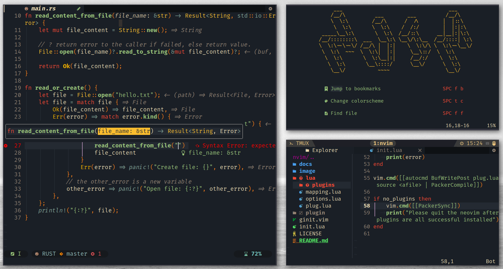

link:#more-screenshot[image:https://img.shields.io/badge/More%20Screenshot-click-blueviolet?logo=googlephotos[badge]]
image:https://github.com/avimitin/nvim/actions/workflows/test.yml/badge.svg[badge]
image:https://github.com/avimitin/nvim/actions/workflows/lint.yml/badge.svg[badge]
image:https://img.shields.io/badge/Language-Lua-blue?logo=lua&logoColor=blue[badge]

=== Guide

*link:./README.md[English] (You are here)* |
link:docs/README_CN.md[中文]

____
中文文档因为我比较懒，所以不能保证完全同步，如果遇到
任何文档不对应的问题，请以英文版为准。
____

If you want a minimal vimrc, use this:

[source,bash]
----
# it is not tested yet, feel free to open issues
curl -SL "https://raw.githubusercontent.com/Avimitin/nvim/master/.vimrc" -o ~/.vimrc
----

=== Features

* Really fast! Start up in only 28ms! (See
link:./benchmark.txt[`benchmark`])
* LSP support
* Completion like VSCode
* Tree file manager
* Symbols explorer
* Buffer line manager
* Fuzzy file/text/image finder
* Floating terminal and REPL support
* Handy git tools
* Motion on speed
* Markdown preview and snippet
* Optimized Rust, C++, Golang, Lua coding experience
* Configured most of the GUI: nvui, neovide, nvim-qt…

=== Installation

I recommend you to use my configuration as a base and build your own
configuration. In my opinion, everyone should have their own customized
neovim. So you can fork my repository and then run:

[source,bash]
----
# NO WINDOWS SUPPORT NOW
git clone https://github.com/YOUR_USER_NAME/nvim ~/.config/nvim
----

Open your neovim by command `nvim` and wait for all plugins installed.
The plugins will be installed automatically. Please quit and reopen the
neovim to load all the plugins.

____
If the neovim don’t install plugins automatically, use the command
`:PackerSync` to install those plugins manually. And please open a issue
to notify me about the error.
____

*NOTE:* Markdown preview plugin is installed in another thread, please
wait for it until it response message of installation success.
Otherwise, you will find that you can’t activate it.

==== Clean Installation

You need to clean the below directory for a fresh install.

[source,bash]
----
# plugins directory
rm -rf ~/.local/share/nvim

# neovim cache file
rm -r ~/.cache/nvim

# neovim plugins load sequence
rm -r ~/.config/nvim/plugin
----

==== Docker

Just wanna have a try but do not want to mess up your local environment?
I have docker script for you!

[source,bash]
----
docker run -w /root -it --rm alpine:edge sh -uelic '
      apk add git neovim ripgrep alpine-sdk --update
      git clone https://github.com/Avimitin/nvim ~/.config/nvim
      nvim -c "autocmd User PackerComplete quitall"
      nvim /root/.config/nvim/README.md
  '
----

=== Dependency

==== Neovim (MUST)

____
Currently I am using `NVIM v0.6.0-dev+501-gcb15055c2`. If you got any
error, please check your neovim version.
____

* Follow https://github.com/neovim/neovim/wiki/Installing-Neovim[neovim
installation].
* Or if you are Arch Linux user: `yay -S neovim-git`

==== Install nerdfont (MUST)

Most of my setting are based on nerd font. It’s highly recommended to
install https://www.nerdfonts.com/font-downloads[nerdfont] for
impressive icon support.

==== Surf (OPTIONAL)

I am using https://surf.suckless.org/[Surf] as my markdown preview
browser. Firefox is too heavy for the preview job. If you have interest
on it, please follow the instruction from the official pages. If not,
you can easily modify the settings:

[source,sh]
----
sed -i 's/surf/firefox/g' ./lua/config/mkdp.lua
----

===== How to build surf

[source,sh]
----
# Arch linux contains most of the library
# Other distro need to check out documents yourself
git clone https://git.suckless.org/surf
cd surf
sudo make clean install
----

==== Check health

Open your neovim and input following command to check if the dependence
is all installed or not.

[source,vim]
----
:checkhealth
----

=== Details about my configuration

See link:./docs/addtional.md[addtional]

=== License

MIT License

=== Credit

This project is originally inspired by
https://github.com/theniceboy/nvim[theniceboy/nvim].

And lua code is inspired by
https://github.com/siduck76/NvChad[siduck76/NvChad].

Take a look at their contribution, which is really fantastic.

=== What does commit message means

Please read
https://github.com/Avimitin/commit-convention[commit-convention]

* new means new update
* rew means refactor
* fix means a fix commit
* odd means it is a trivial commit (this commit don’t affect the code)
* doc means documents update
* ! means breaking change

Users only need to take care of commit with `!` suffix and `new/rew/fix` prefixes.

=== TODO

* ☐ Introduce my workflows
* ☐ Optimized neovim start up time based on each file

=== More Screenshot

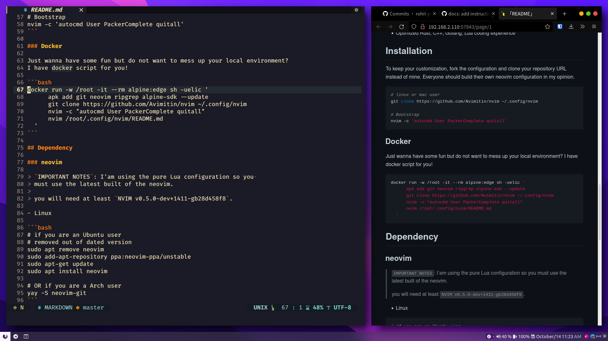

'''''

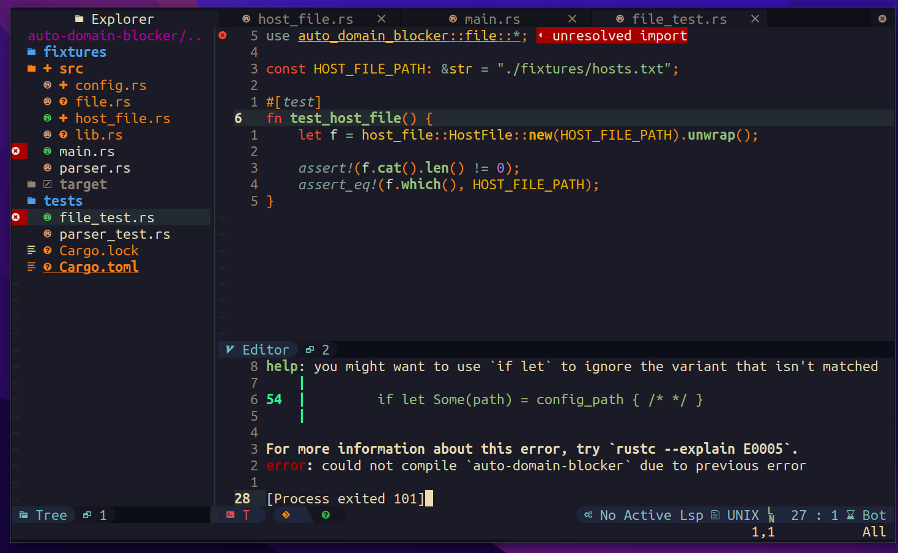

'''''

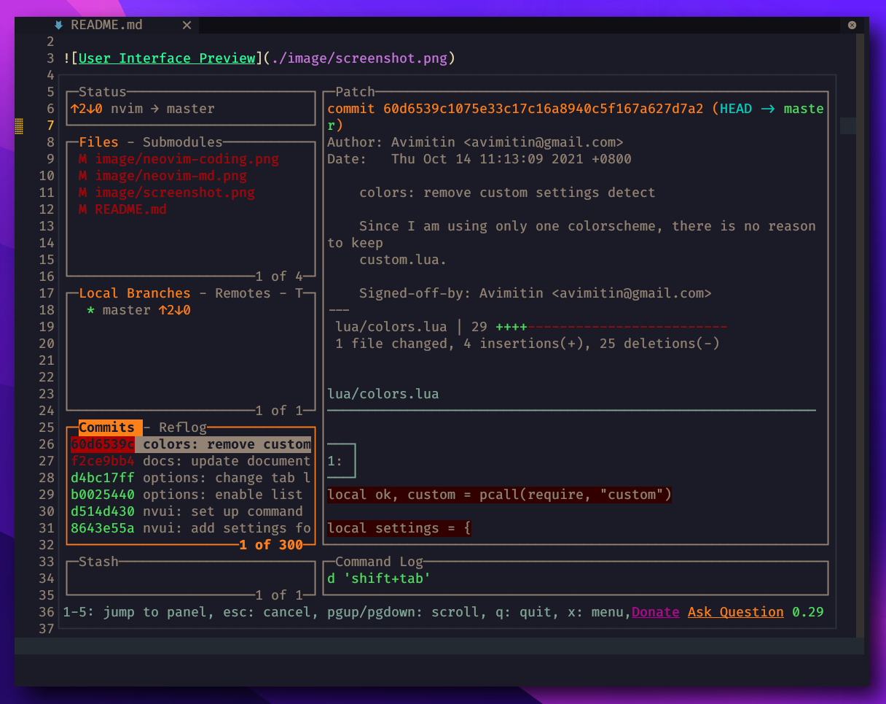

'''''

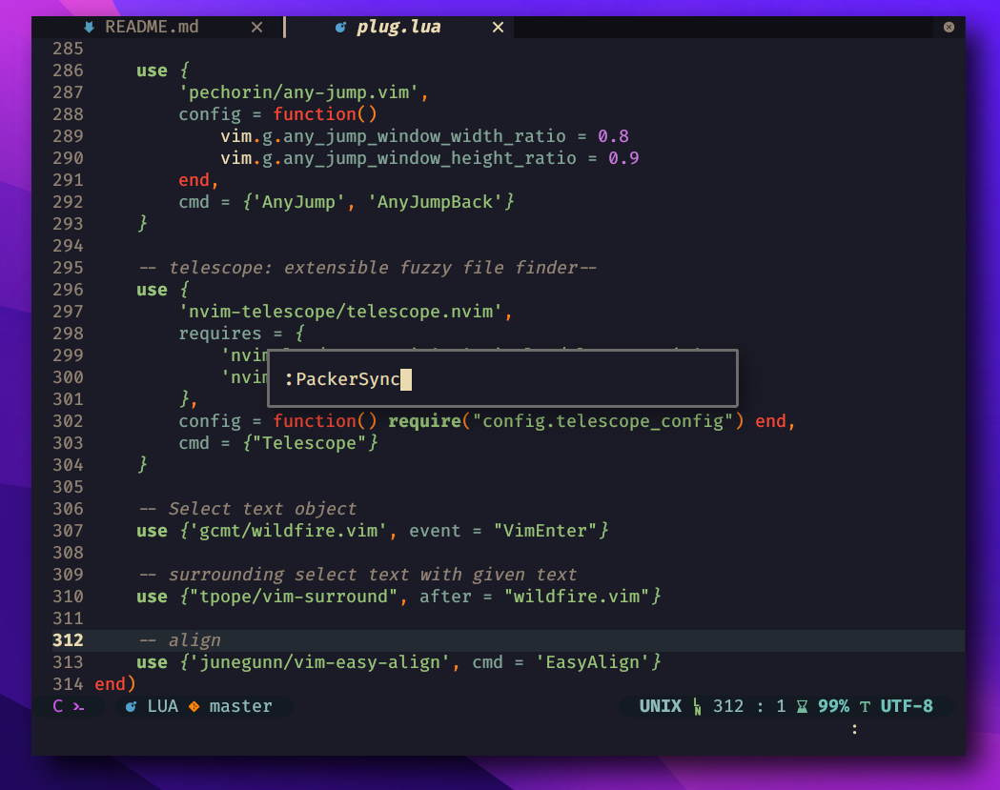

'''''

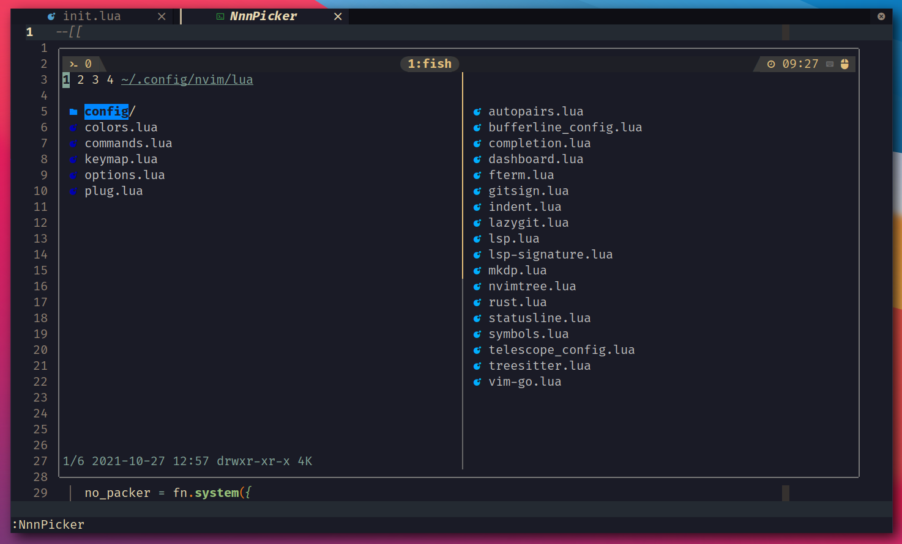

==== neogit

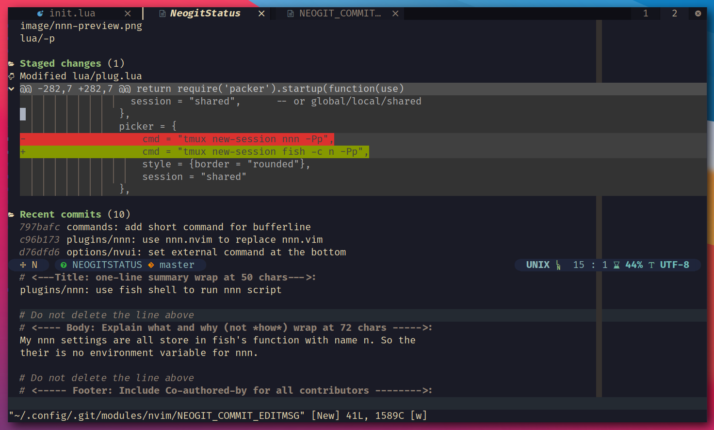

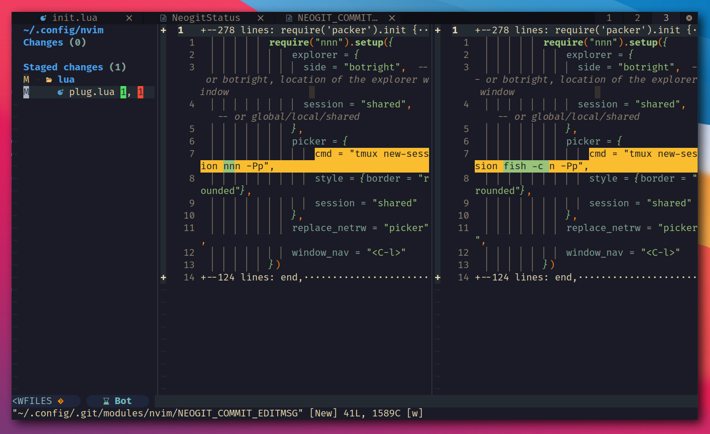

==== fugitive

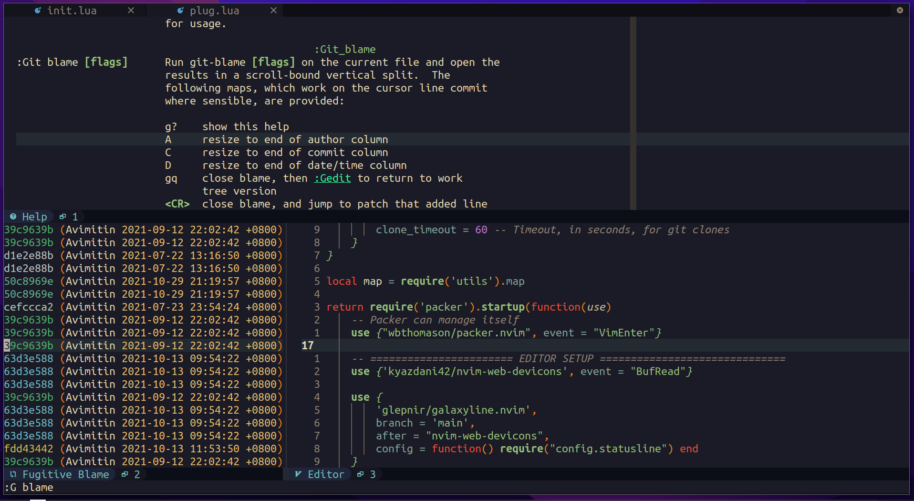

==== Dap Debug

* CPP

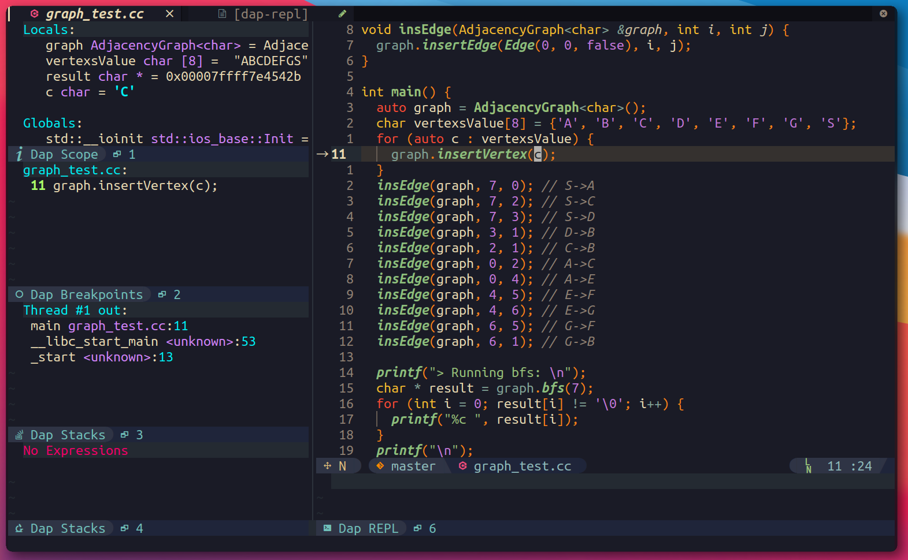

* Rust

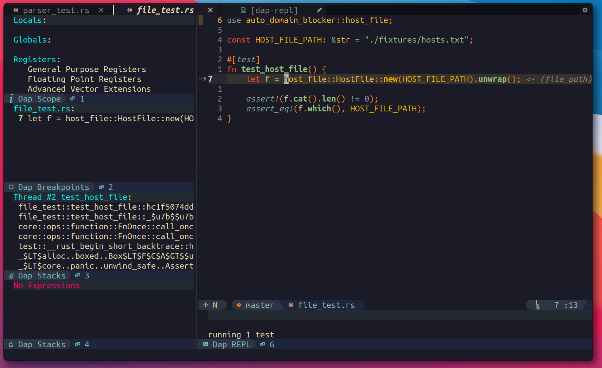
