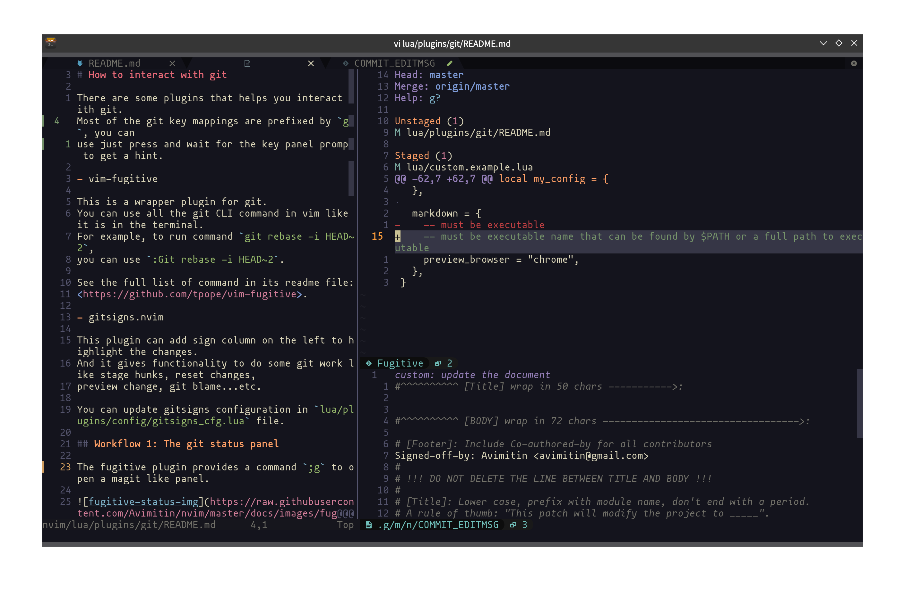

++++
<h1 align="center">My Neovim Configuration</h1>

++++

link:#more-screenshot[image:https://img.shields.io/badge/More%20Screenshot-click-blueviolet?logo=googlephotos[badge]]
image:https://github.com/avimitin/nvim/actions/workflows/test.yml/badge.svg[badge]
image:https://github.com/avimitin/nvim/actions/workflows/lint.yml/badge.svg[badge]
image:https://img.shields.io/badge/Language-Lua-blue?logo=lua&logoColor=blue[badge]
image:https://img.shields.io/github/contributors/Avimitin/nvim?color=dark-green[badge]
image:https://img.shields.io/github/issues/Avimitin/nvim[issue]
image:https://img.shields.io/github/license/Avimitin/nvim[license]
image:https://img.shields.io/github/forks/Avimitin/nvim?style=social[badge]
image:https://img.shields.io/github/stars/Avimitin/nvim?style=social[stargazer]

== Motivation

I want a text editor which:

* Really really fast. I don't need to care I will have to spend seconds or minutes on
opening a text file. (See link:./utils/benchmark.txt[`benchmark`])
* Really really powerful. I can use it to learn all the programming languages. I don't
need to install IDE per language.
* Really really handy. I don't need to move my hand to my mouse. I don't need to click
the keyboard too much. I can have my cursor in place at the moment my eye first skim.
* Really really beautiful. I can treat it as a work of art, not a tool.

== Getting Start

I recommend you use my configuration as a base and build your
configuration. In my opinion, everyone should have their customized
neovim. You can press the fork button to clone my project. (Don't forget
to smash the star button! :) )

Then, follow the installation instruction here:
https://avimitin.github.io/nvim/en_us/installation.html[document(WIP)]

''''

If you want a minimal vimrc, use this:

....
# it is not tested yet, feel free to open issues

curl -SL "https://raw.githubusercontent.com/Avimitin/nvim/master/.vimrc" -o ~/.vimrc
....

== Details about my configuration

See https://avimitin.github.io/nvim[document(WIP)].

== License

MIT License

== Credit

This project is originally inspired by
https://github.com/theniceboy/nvim[theniceboy/nvim].

And lua code is inspired by
https://github.com/siduck76/NvChad[siduck76/NvChad].

Take a look at their contribution, which is really fantastic.

== Development Related

=== About Commit

Please read
https://github.com/Avimitin/commit-convention[commit-convention]

=== About version

I am using semantic version as the version style. And I am following
the https://doc.rust-lang.org/cargo/reference/semver.html#change-categories[Cargo Book]
as semver guidance.

Bug fix or trivial modification will be treated as a patch change. New plugin
or any functionality removal will be treated as a minor change. Only when I
totally rewrite the whole project, I will increase the major number. (Like
vimscript -> Lua.)

Some convention is described here: link:./docs/semver.md[semver]

== More Screenshot

image::./docs/images/neovim-md.png[markdown]

'''''

image::./docs/images/neovim-coding.png[coding]

'''''

image::./docs/images/neovim-lazygit.png[lazygit]

'''''

image::./docs/images/nvui-ext-cmd.png[nvui]

'''''

image::./docs/images/vfiler.png[VFiler]

'''''

image::./docs/images/lightspeed.png[LightSpeed]

'''''

image::./docs/images/anyjump.png[Anyjump]

'''''

image::./docs/images/help.png[lsp]

image::./docs/images/codeaction.png[lsp]

image::./docs/images/diagnostic.png[lsp]

=== fugitive

image::./docs/images/fugitive.png[fugitive]

=== Dap Debug

* CPP

image::./docs/images/dap-debug-cpp.png[cpp]

* Rust

image::./docs/images/dap-debug-rust.png[Rust]

=== Colorscheme Galery

See link:./docs/src/en_us/colors.md[Colors document]

// vim: tw=80 fo+=t
