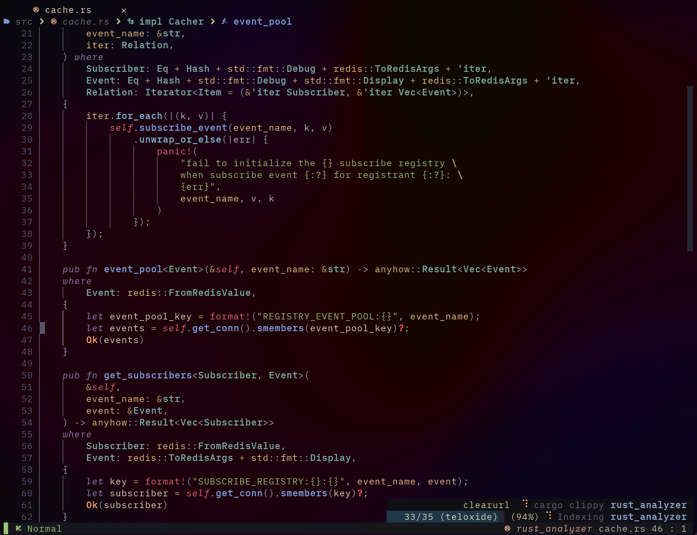
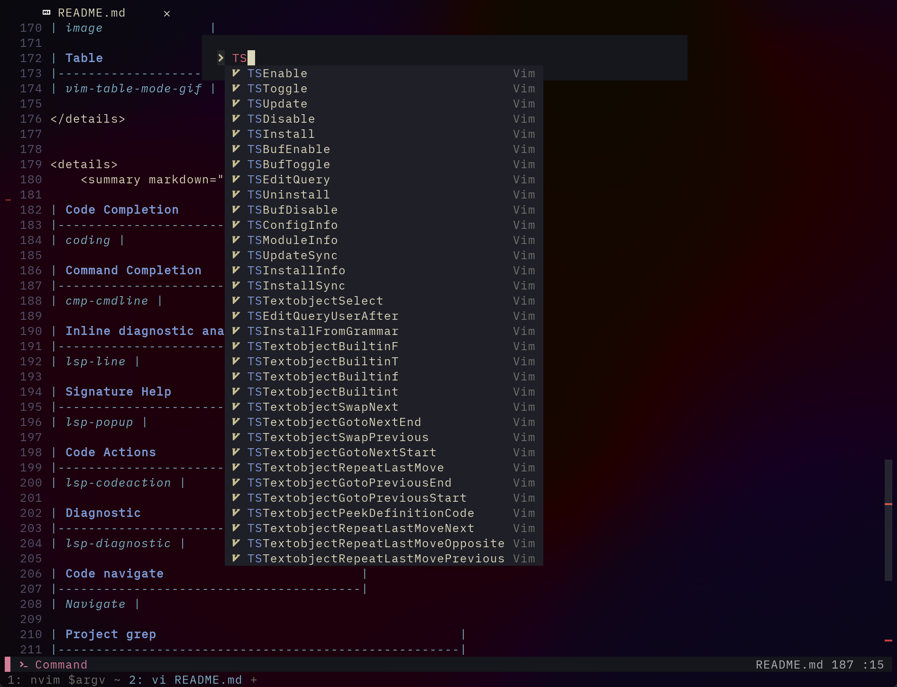
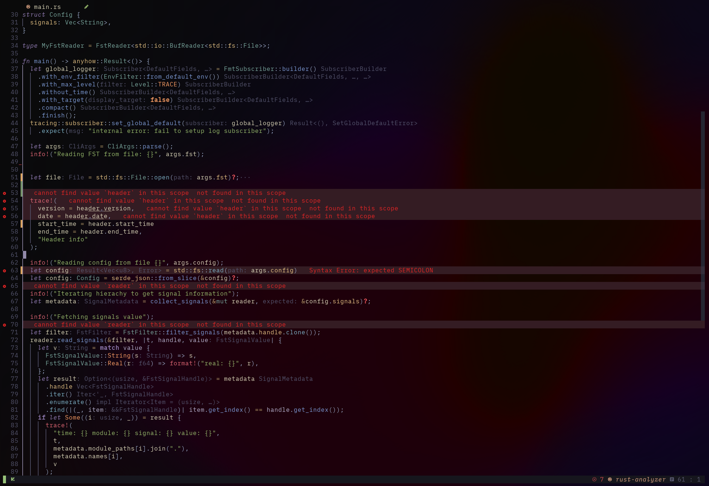
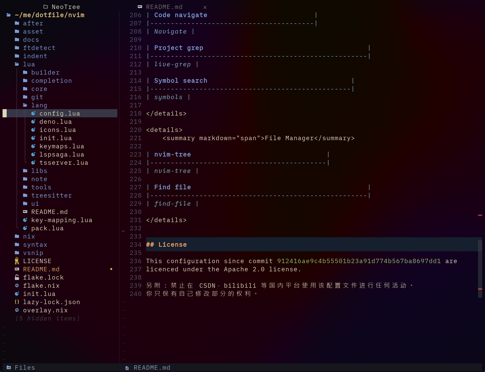

<h1 align="center">My Neovim Configuration</h1>


## Features

* ***Handy*** and ***Smoothy***: There will always be a panel to remind you
when you forget your key settings. There will always be a short keystroke to help
you get to the place you want to jump to. There will always…
* ***Powerful*** coding experience: nvim-lspconfig powered great LSP experient.
* ***Fancy looking***: Well designed, denoised, uncluttered UI. Talk is cheap, see the [gallery](#Gallery).
* ***Great Performance***: Lazy loading anywhere, you will never have to worry about accidental opening of a file larger than 10000 loc can freeze your terminal.

## Getting Start

This configuration is compatible with neovim 0.10+ version.

```bash
git clone --depth=1 https://github.com/Avimitin/nvim.git ~/.config/nvim
```

Finally, input `nvim` to open the editor, and all plugins will be downloaded automatically.

```bash
nvim
```

To use this in your home-manager, you can use the xdg.configFile attribute:

```nix
{ pkgs }:
{
  xdg.configFile = {
    neovim = {
      target = "nvim";
      source = pkgs.fetchFromGitHub {
        repo = "nvim";
        owner = "Avimitin";
        rev = "...";
        hash = "...";
      }
    };
  };
}
```

Diagnostic error/warning/hint are highlighted with undercurl, please use [kitty](https://sw.kovidgoyal.net/kitty/), [wezterm](https://wezfurlong.org/wezterm/index.html)
or anyother terminal that support undercurl.

If you are using tmux, to have a correct display, you can try my configuration below:

```tmux
# (MUST) Enable 256 color for tmux
set -g default-terminal "tmux-256color"

# (Optional, choose any of them)
# Enable true color and undercurl for wezterm
set -as terminal-features ",wezterm*:RGB"
set -as terminal-features ",wezterm*:usstyle"
# Same as above, but for kitty. (kitty doesn't support Windows so I have to keep two configuration here)
set -as terminal-features ",kitty*:RGB"
set -as terminal-features ",kitty*:usstyle"
# Same as above, but for SSH. This is useful because I am using `alias ssh="TERM=xterm-256color exec ssh"`
set -as terminal-features ",xterm-256color*:RGB"
set -as terminal-features ",xterm-256color*:usstyle"
set -as terminal-overrides ",xterm*:Tc"

# (MUST) This hijack the neovim undercurl char sequence, to avoid tmux escape them.
set -as terminal-overrides ',*:Smulx=\E[4::%p1%dm'
```

## Project Structure


- `lua`: the configuration core

    * `key-mapping.lua`: my modification to the built-in key mappings
    * `pack.lua`: script to download lazy.nvim plugin manager
    * `core/`: my modification to the built-in options and auto commands
    * `completion/`: plugins and configuration for LSP and vim command completion
    * `git/`: plugin and configuration for using git in Neovim
    * `lang/`: plugins and configuration for using LSP server and get diagnostic in Neovim
    * `libs/`: functions that I don't want to write twice
    * `note/`: markdown and neorg support for neovim
    * `tools/`: miscellaneous plugins that can enhance editing experience
    * `treesitter/`: plugins for text object highlight and editing
    * `ui/`: plugins for decorating the neovim

- `after/ftplugin/<lang>.lua`: configured LSP settings for each different language
- `ftdetect`: list of script to help neovim identify filetype for some file
- `indent`: list of script to help neovim properly set indentation
- `syntax`: additional syntax detection for some file type
- `vsnip`: my snippets


## Treesitter parsers in nix

- For normal user: make sure gcc is installed, then run `:TSInstall <language>` to compile and install corresponding treesitter plugin
- For nix user: you can add this repository as an overlay and use the pre-bundled neovim:

```nix
# flake.nix
{
  description = "Simple home-manager neovim configuration";

  inputs = {
    nixpkgs.url = "github:NixOS/nixpkgs/nixos-unstable";
    my-neovim.url = "github:Avimitin/nvim";
    home-manager = {
      url = "github:nix-community/home-manager";
      inputs.nixpkgs.follows = "nixpkgs";
    };
  };

  outputs = { self, nixpkgs, flake-utils, home-manager, my-neovim }: {
    homeConfiguration = home-manager.lib.homeManagerConfiguration {
      # import my overlay, it will add a new `neovim-nightly` derivation into your nixpkgs
      pkgs = import nixpkgs { system = "x86_64-linux" overlays = [ my-neovim.overlays.default ];  };
      modules = [
        ({ pkgs }: {
          # Then add the pre-bundled neovim into your home configuration
          home.packages = [
            pkgs.neovim-nightly
          ];
        })
      ];
    };
  };
}
```


## Gallery

<details>
    <summary markdown="span">Utilities</summary>

| Easy in-file jump                             |
| --------------------------------------------- |
|    |

</details>


<details>
    <summary markdown="span">Markdown Utils</summary>

| Markdown Preview                                   |
|----------------------------------------------------|
|               |

| Table                                              |
|----------------------------------------------------|
|  |

</details>


<details>
    <summary markdown="span">Coding Utils</summary>

| LSP Progress |
|-----------------|
|   |

| Symbol Tree |
|-----------------|
|   |

| Code Completion                       |
|---------------------------------------|
|  |

| Command Completion                                 |
|----------------------------------------------------|
|  |

| Errorlens Like diagnostic |
|-----------------------------|
|  |

| Signature Help                       |
|--------------------------------------|
|  |

| Code Actions                                    |
|-------------------------------------------------|
|  |

| Diagnostic                                      |
|-------------------------------------------------|
|  |

| Code navigate                          |
|----------------------------------------|
|  |

| Project grep                                        |
|-----------------------------------------------------|
|  |

| Symbol search                                   |
|-------------------------------------------------|
|  |

</details>

<details>
    <summary markdown="span">File Manager</summary>

| neotree                                 |
|-------------------------------------------|
|  |

| Find file                                           |
|-----------------------------------------------------|
|  |

</details>

<details>
    <summary markdown="span">Themes</summary>

| Kanagawa Theme                          |
|-----------------------------------------|
|  |

</details>

## License

This configuration since commit `912416ae9c4b55501b23a91d774b567ba8697dd1` are
licenced under the Apache 2.0 license.

另附：禁止在 CSDN，bilibili 等国内平台使用该配置文件进行任何活动。
你只保有自己修改部分的权利。

## Additional notes

### About treesitter bumping

- Run `:Lazy sync`
- Remove hash in ./nix/nvim-treesitter-lock-file.nix
- Run `nix build '.#neovim-nightly'`
- Update hash
- Run `nix run '.#ruby' ./nix/update_ts_parser.rb`
- Run `nix build '.#neovim-nightly'`

