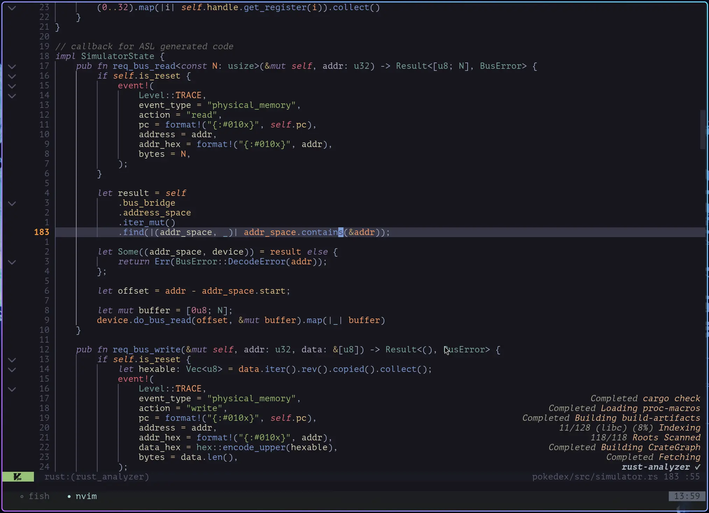

# Neovim Configuration



This Neovim configuration is built with a focus on a simple, elegant, and
distraction-free user interface. The goal is to enhance coding usability rather
than overwhelm with fancy, unnecessary UI elements. I will consistently add and
test plugins with multiple coding scenario, keep only those are suitable for
daily use.

- Clean & Minimalist Aesthetic: Enjoy a calm, focused coding environment that
prioritizes what matters most: your code.
- Streamlined Workflow: Optimized for efficiency, allowing you to code faster
and with less friction.
- Essential Tooling: Includes carefully selected plugins and settings that
genuinely improve the coding experience without adding clutter.
- Performance-Oriented: Lightweight and responsive, ensuring a smooth
experience even with larger projects.
- Focus on Readability: UI elements are designed to be clear and unobtrusive,
making your code the star of the show.
- Usability First: Every feature and plugin is chosen with practical coding
benefits in mind, not just for visual appeal.

## Getting Start

This configuration is compatible with neovim 0.10+ version.

```bash
git clone --depth=1 https://github.com/Avimitin/nvim.git ~/.config/nvim
```

Finally, input `nvim` to open the editor, and all plugins will be downloaded automatically.

```bash
nvim
```

### Flake

This repository is also a flake. You can run it directly:

```bash
nix run github:Avimitin/nvim
```

Or add it to your configuration inputs:

```nix
{
  inputs = {
    # ...
    nvim-config.url = "github:Avimitin/nvim";
  };

  outputs = { self, nixpkgs, nvim-config, ... }: {
    # ...
    nixosConfigurations.machine = nixpkgs.lib.nixosSystem {
      system = "x86_64-linux";
      modules = [
        ({ pkgs, ... }: {
          environment.systemPackages = [
            nvim-config.packages.${pkgs.system}.default
          ];
        })
      ];
    };
  };
}
```

Diagnostic error/warning/hint are highlighted with undercurl, please use
[kitty](https://sw.kovidgoyal.net/kitty/),
[wezterm](https://wezfurlong.org/wezterm/index.html)
or anyother terminal that support undercurl.

If you are using tmux, to have a correct display, you can try my configuration below:

```tmux
# (MUST) Enable 256 color for tmux
set -g default-terminal "tmux-256color"

# (Optional, choose any of them)
# Enable true color and undercurl for wezterm
set -as terminal-features ",wezterm*:RGB"
set -as terminal-features ",wezterm*:usstyle"
# Same as above, but for kitty. (kitty doesn't support Windows so I have to keep two configuration here)
set -as terminal-features ",kitty*:RGB"
set -as terminal-features ",kitty*:usstyle"
# Same as above, but for SSH. This is useful because I am using `alias ssh="TERM=xterm-256color exec ssh"`
set -as terminal-features ",xterm-256color*:RGB"
set -as terminal-features ",xterm-256color*:usstyle"
set -as terminal-overrides ",xterm*:Tc"

# (MUST) This hijack the neovim undercurl char sequence, to avoid tmux escape them.
set -as terminal-overrides ',*:Smulx=\E[4::%p1%dm'
```

## Project Structure

- `lsp/*.lua`: Built-in `vim.lsp` configuration
- `lua`: the configuration core

    * `completion/`: plugins and configuration for LSP completion
    * `core/`: autocmds and vim options
    * `git/`: plugin and configuration for using git in Neovim
    * `lang/`: UI and key mapping configuration for LSP
    * `libs/`: functions that I don't want to write twice
    * `tools/`: miscellaneous plugins that can enhance editing experience
    * `treesitter/`: plugins for text object highlight and editing
    * `ui/`: plugins for decorating the neovim
    * `pack.lua`: script to download lazy.nvim plugin manager

- `ftdetect`: List of script to help neovim identify filetype for some file, not important.
- `after/ftplugin/<lang>.lua`: configuration for non-default filetypes
- `indent`: List of script to help neovim properly set indentation, not important.
- `syntax`: Additional syntax detection for some file type, not important.

## License

This configuration since commit `912416ae9c4b55501b23a91d774b567ba8697dd1` are
licenced under the Apache 2.0 license.

另附：禁止在 CSDN，bilibili 等国内平台使用该配置文件进行任何活动。
你只保有自己修改部分的权利。
