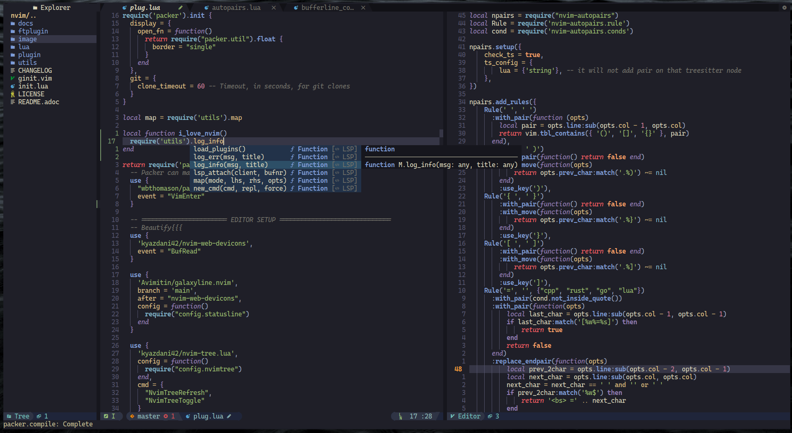

<h1 align="center">My Neovim Configuration</h1>


## Important Notes

This project is still under active development, so new versions and breaking changes
will be released frequently.

Although version 3.0 has been released, the reason for 3.0 here is that vimscript
has been replaced with Lua, so you should think of this project as a 0.x version of Lua.

## Motivation

I want a text editor which is:

* Fast. I don't need to care if I will have to spend seconds or minutes on
opening a text file.
* Powerful. I can use it to learn all the programming languages. I don't
need to install IDE per language.
* Handy. I don't need to move my hand to my mouse. I don't need to click
the keyboard too much. I can have my cursor in place at the moment my eye first skim.
* Fansy. I can treat it as a work of art, not a tool.

## Getting Start

I recommend you use my configuration as a base and build your
configuration. In my opinion, everyone should have their customized
neovim. You can press the fork button to clone my project. (Don't forget
to smash the star button! `:)`)

Then, clone the repo:

```bash
git clone https://github.com/Avimitin/nvim.git ~/.config/nvim
```

You can read the full installation documentation here:
[*Installation Guide*](https://avimitin.github.io/nvim/en_us/installation.html)

> ***Minimal vimrc***: If you want a minimal vimrc, use this
>
> ```bash
> # it is not tested yet, feel free to open issues
> curl -SL "https://raw.githubusercontent.com/Avimitin/nvim/master/.vimrc" -o ~/.vimrc
>```

## Details about my configuration

Please read [nvim book(WIP)](https://avimitin.github.io/nvim).

## Show cases

So, what will you get from my configuration?

### Speed

I have optimized almost every plugins.
Plugins can only be loaded when they are required.
They will not delay the editor to start up.
For an empty buffer, neovim takes only *25ms* to start up in average.

You can read the [benchmark file](./fixtures/benchmark.txt)
for the speed.

### Motion

With the help from lightspeed, I can hop in place with few keys.


### Markdown

Markdown can be generated in time with command `:MarkdownPreview`.


Also, there are bunch of other utilities provided by
[vim-markdown](https://github.com/plasticboy/vim-markdown).

Besides, we have the most powerful table tools in vim:
[vim-table-mode](https://github.com/dhruvasagar/vim-table-mode/)

### Colorscheme

With the help from treesitter, we can have amazing code highlight.

You can see available colorscheme here: [colors.md](./docs/src/en_us/colors.md)

### Coding

First of all, you will have configured completion menu.



Then, you can use `:LspInstall` to install language server.


`Rust`, `C++`, `Lua`, `Golang` are configured by default.
After the installation, you will get a VSCode like coding editor:

* Document pop up


* Code actions


* diagnostic panel


* Debug

1. CPP


2. Rust


* Code navigate


* Git tools

1. fugitive


2. lazygit


* file manager


## License

MIT License

## Credit

The v1.0-vimscript version is originally inspired by
[theniceboy/nvim](https://github.com/theniceboy/nvim).

And lua code since v2.0 is inspired by
[siduck76/NvChad](https://github.com/siduck76/NvChad).

Take a look at their contribution, which is really fantastic.

## Development Related

Please read [development specifications](./docs/src/en_us/development.md).
