<h1 align="center">My Neovim Configuration</h1>
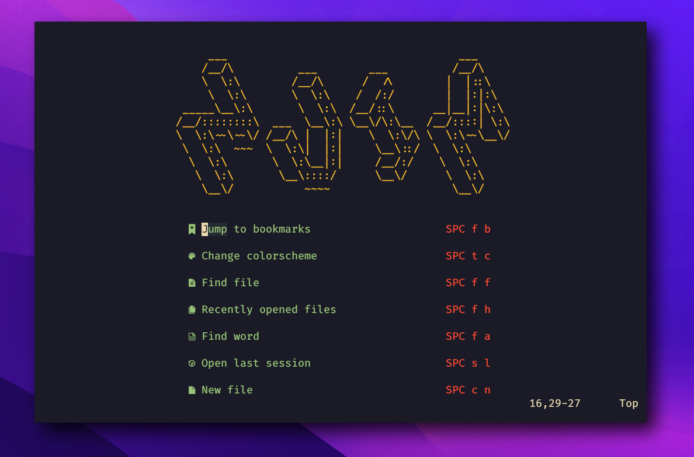


## Features

* ***Handy*** and ***Smoothy***: There will always be a panel to remind you
when you forget your key settings. There will always be a short keystroke to help
you get to the place you want to jump to. There will always…
* ***Powerful*** coding experience: With the power from nvim-lspconfig, we can
have "IDE Level" coding experience in the terminal.
* ***Fancy looking***: Talk is cheap, see the [gallery](#Gallery).
* ***Easy Customize***: Always injecting new configuration, wherever you like.

## Getting Start

This configuration is compatible with neovim 0.8+ version.

```bash
git clone --depth=1 https://github.com/Avimitin/nvim.git ~/.config/nvim
```

Finally, input `nvim` to open the editor, and all plugins will be downloaded automatically.

```bash
nvim
```

## Document

See [Docs](https://avimitin.github.io/nvim).

## Customize

See [docuement](./lua/core/README.md)

## Gallery

<details>
    <summary markdown="span">Utilities</summary>

| Easy in-file jump                             |
| --------------------------------------------- |
| 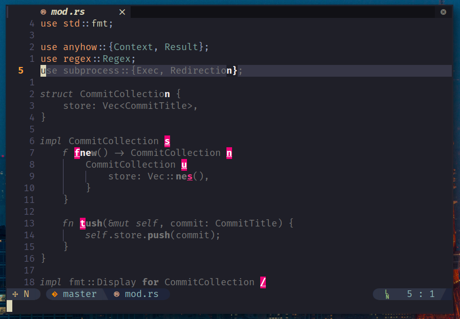   |

</details>


<details>
    <summary markdown="span">Markdown Utils</summary>

| Markdown Preview                                   |
|----------------------------------------------------|
|               |

| Table                                              |
|----------------------------------------------------|
|  |

</details>


<details>
    <summary markdown="span">Coding Utils</summary>

| Diagnostic Panel |
|-----------------|
| 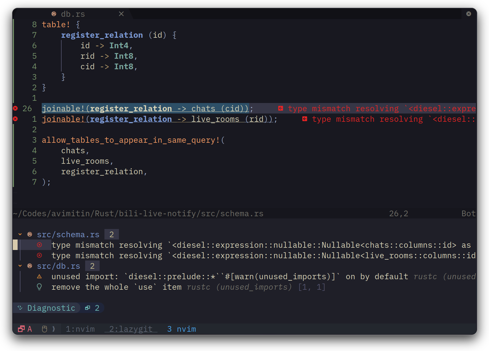  |

| Code Completion                       |
|---------------------------------------|
| 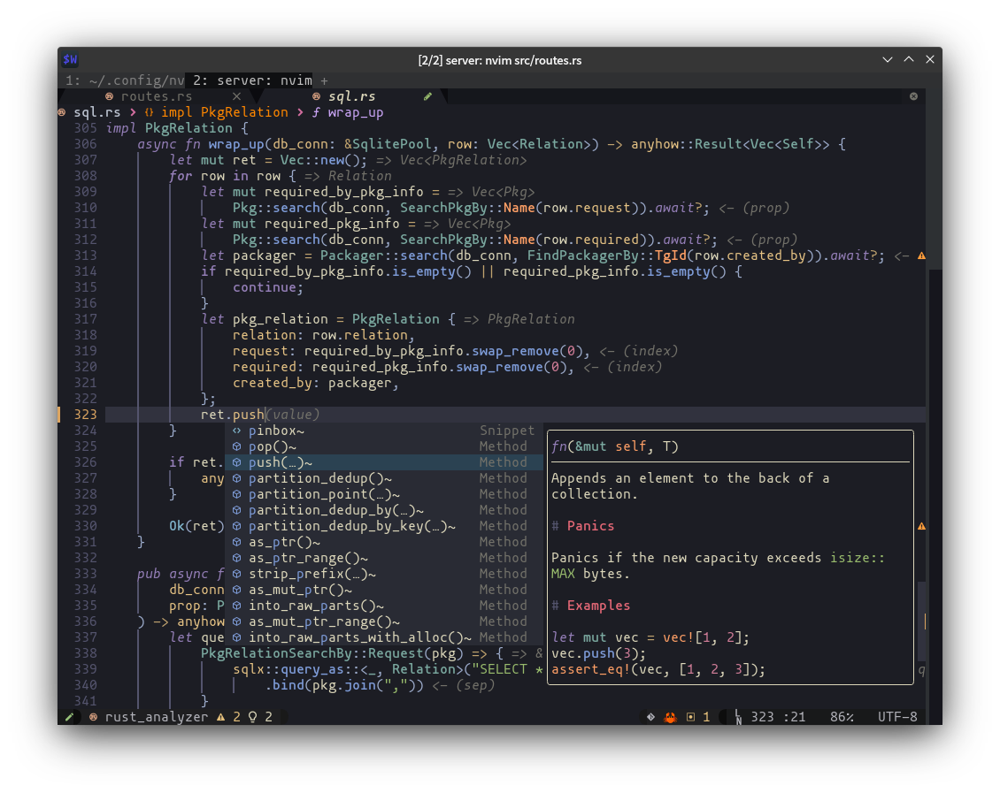 |

| Command Completion                                 |
|----------------------------------------------------|
| 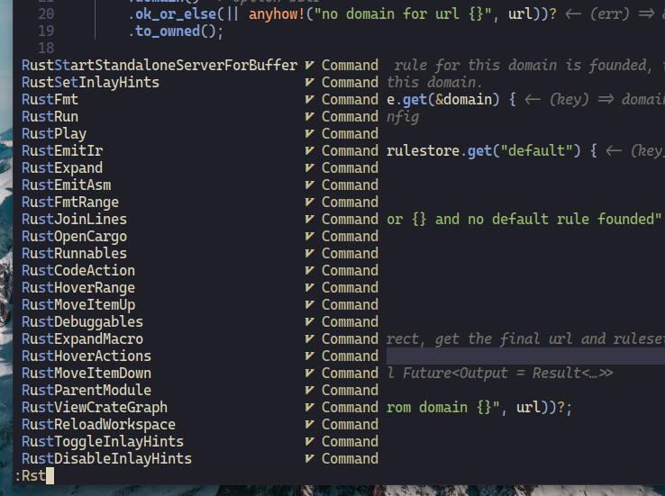 |

| Inline diagnostic analytics |
|-----------------------------|
| 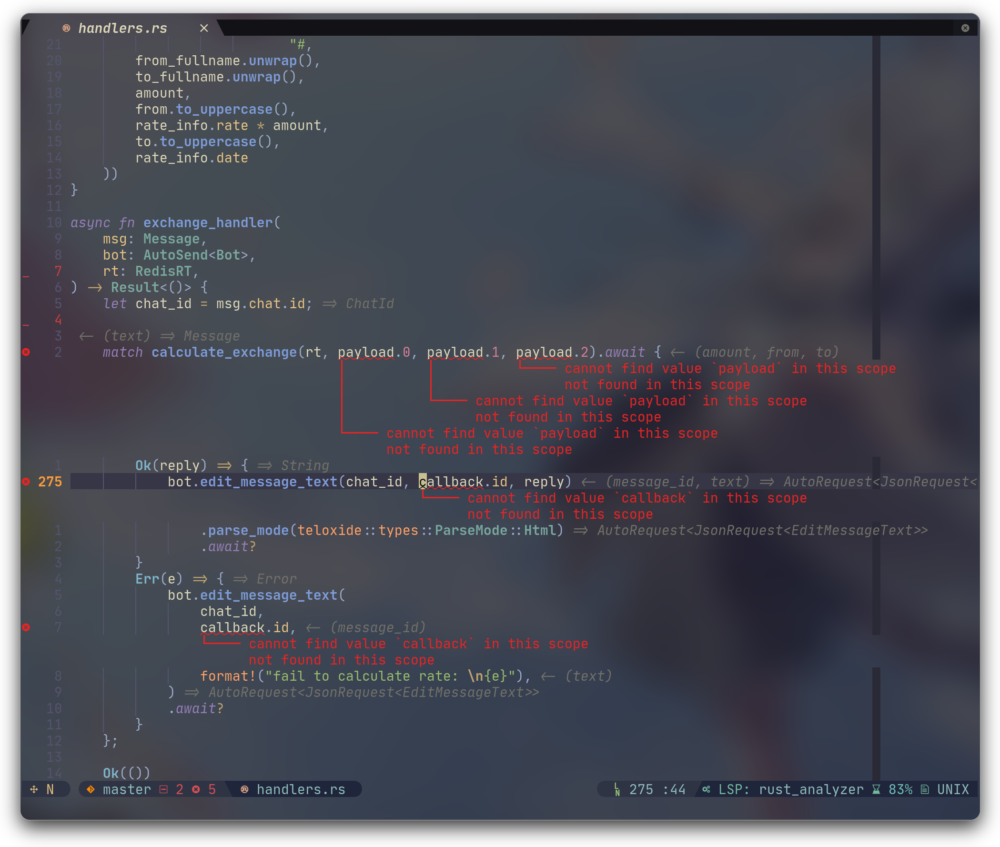 |

| Signature Help                       |
|--------------------------------------|
| 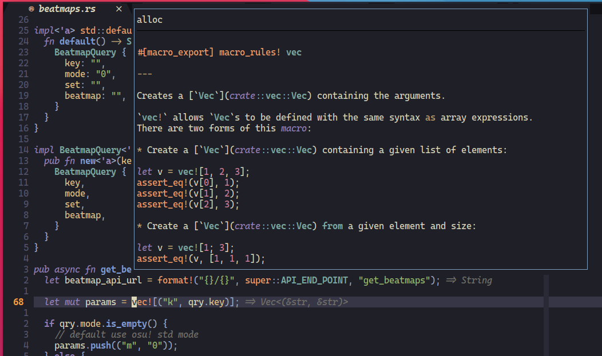 |

| Code Actions                                    |
|-------------------------------------------------|
| 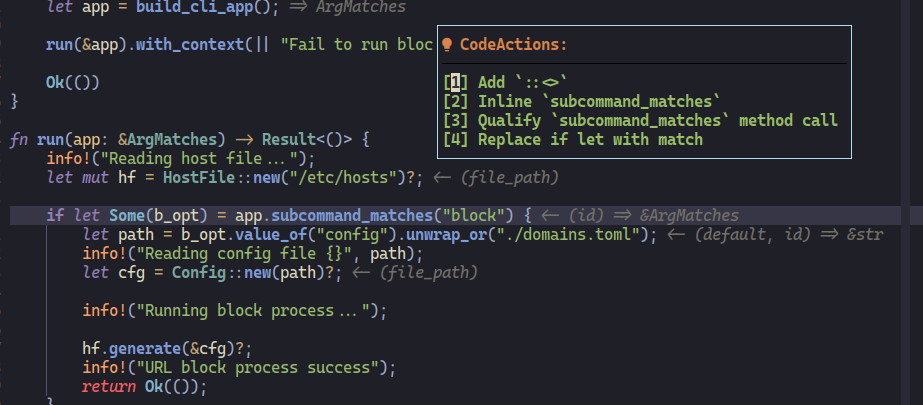 |

| Diagnostic                                      |
|-------------------------------------------------|
| 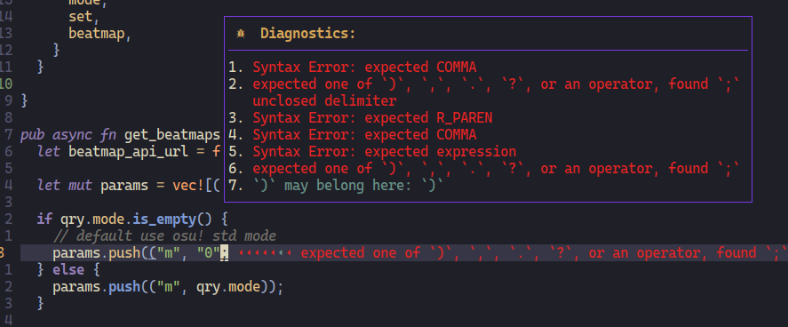 |

| Debug CPP                               |
|-----------------------------------------|
|  |

| Debug Rust                                |
|-------------------------------------------|
|  |

| Code navigate                          |
|----------------------------------------|
| 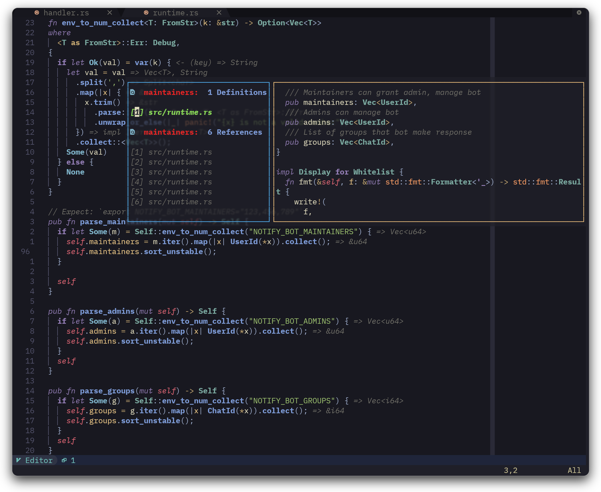 |

| Project grep                                        |
|-----------------------------------------------------|
| 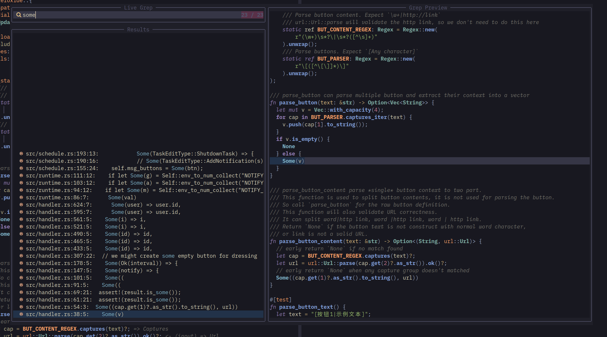 |

| Symbol search                                   |
|-------------------------------------------------|
| 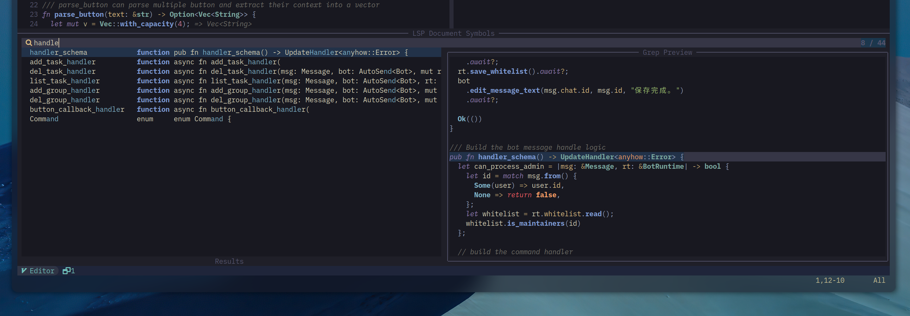 |

</details>

<details>
    <summary markdown="span">File Manage</summary>

| nvim-tree                                 |
|-------------------------------------------|
| 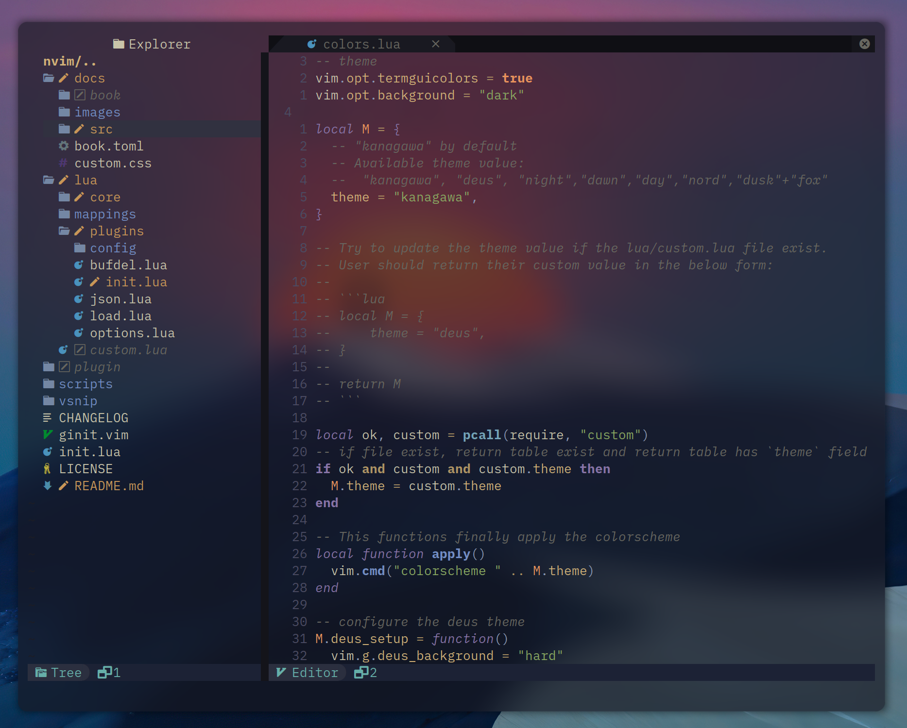 |

| Find file                                           |
|-----------------------------------------------------|
| 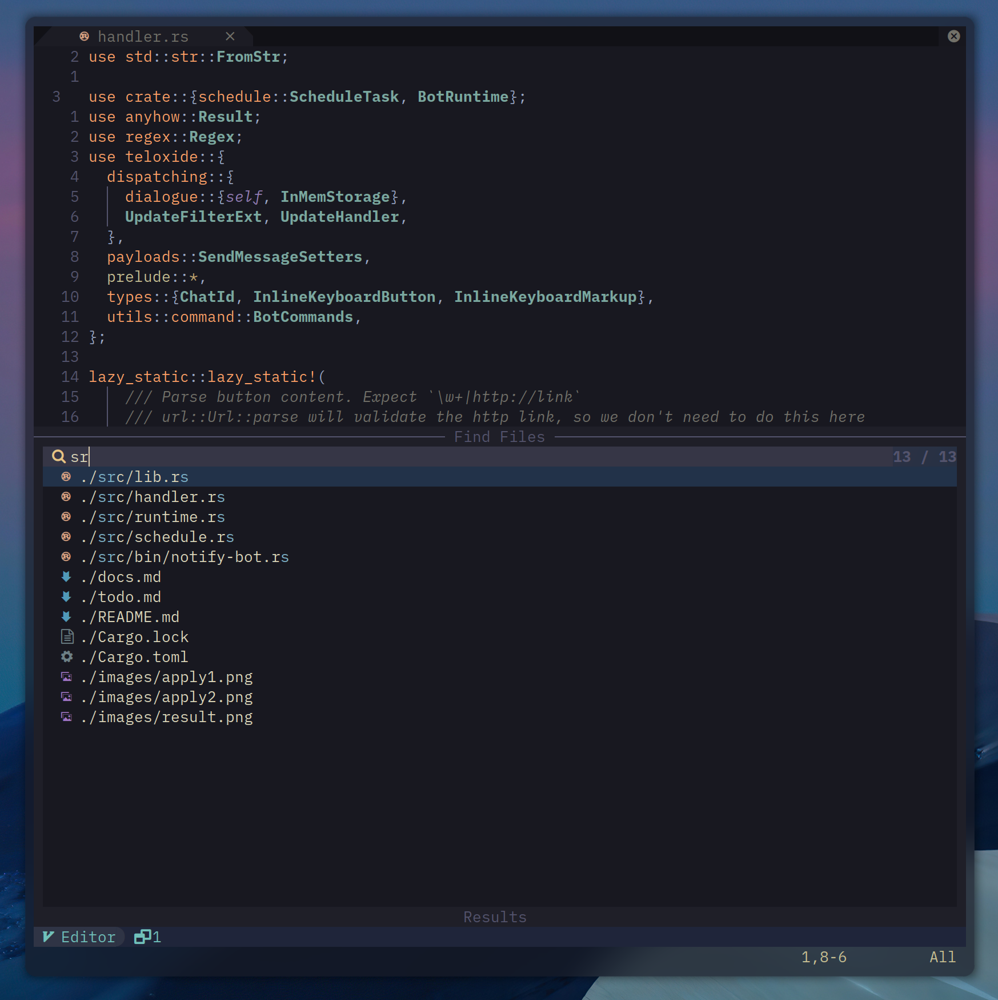 |

</details>

<details>
    <summary markdown="span">Git Helper</summary>

| Fugitive                                       |
|------------------------------------------------|
| 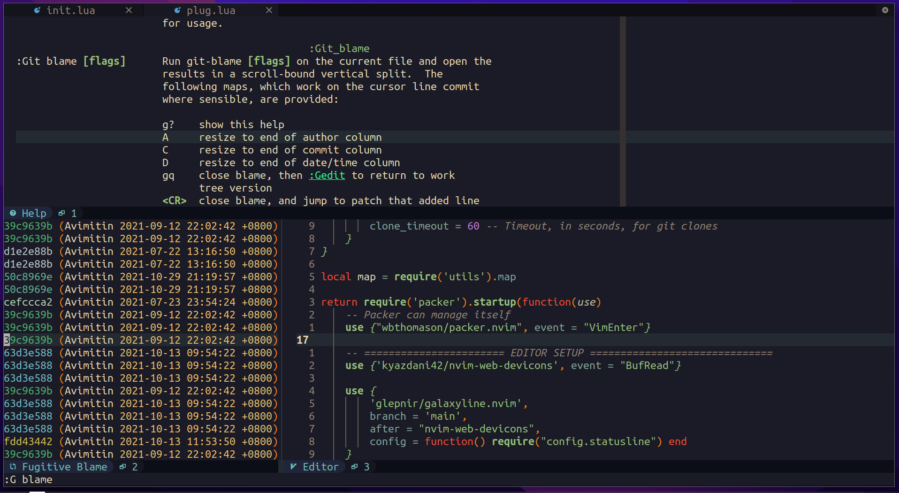 |

</details>


<details>
    <summary markdown="span">Themes</summary>

| Kanagawa Theme                          |
|-----------------------------------------|
| 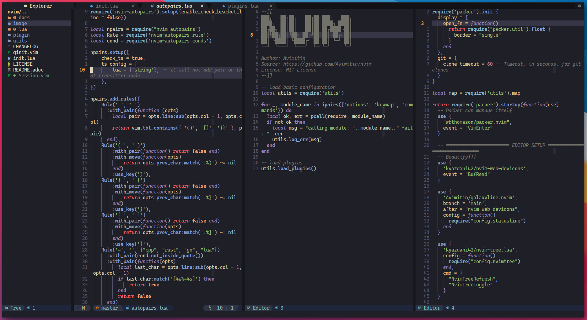 |

| Deus Theme                           |
| ------------------------------------ |
| 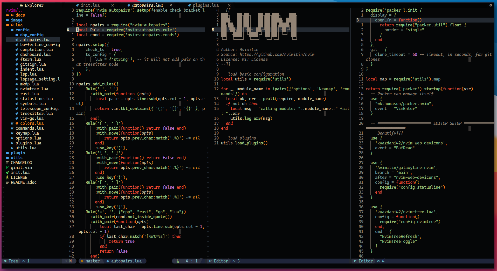  |

| GitHub Light Theme                                                                                                                                                        |
|---------------------------------------------------------------------------------------------------------------------------------------------------------------------------|
| 

</details>

## License

This configuration since commit `912416ae9c4b55501b23a91d774b567ba8697dd1` are
licenced under the Apache 2.0 license.

另附：禁止在 CSDN，bilibili 等国内平台使用该配置文件进行任何活动。
你只保有自己修改部分的权利。

## Development Related

### Versioning

Version will be released in `cvYYYY.0M.0D` format. I will try to release update each weak.

### Changelog

See [RELEASES.md](./RELEASES.md)

<br/>
