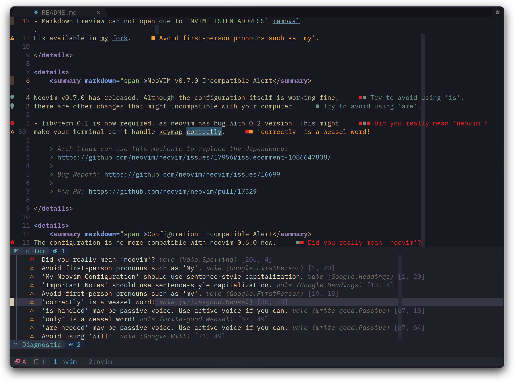

<h1 align="center">My Neovim Configuration</h1>


## Important Notes

<details>
    <summary markdown="span">Neovim v0.8.0 Incompatible Alert</summary>

- Markdown Preview can not open due to `NVIM_LISTEN_ADDRESS` [removal](https://github.com/iamcco/markdown-preview.nvim/issues/452).
Fix available in my [fork](https://github.com/Avimitin/markdown-preview.nvim).

</details>

<details>
    <summary markdown="span">NeoVIM v0.7.0 Incompatible Alert</summary>

Neovim v0.7.0 has released. Although the configuration itself is working fine,
there are other changes that might incompatible with your computer.

- libvterm 0.1 is now required, as neovim has bug with 0.2 version. This might
make your terminal can't handle keymap correctly.

    > Arch Linux can use this mechanic to replace the dependency:
    > https://github.com/neovim/neovim/issues/17956#issuecomment-1086647838/
    >
    > Bug Report: https://github.com/neovim/neovim/issues/16699
    >
    > Fix PR: https://github.com/neovim/neovim/pull/17329

</details>

<details>
    <summary markdown="span">Configuration Incompatible Alert</summary>
The configuration is no more compatible with neovim 0.6.0 now.
If you are still using neovim 0.6.0, please checkout to the 4.0.2 version:

```bash
git clone https://github.com/Avimitin/nvim
git checkout 4.0.2
```
</details>

<details>
    <summary markdown="span">Configuration capabilities list</summary>

| Neovim Version                   | Configuration Version |
|----------------------------------|-----------------------|
| `NVIM-v0.8.0-dev+98-g069da468d5` | `HEAD`                |
| `NVIM v0.8.0`                    | `6.0.0`               |
| `NVIM v0.7*`                     | `5.2.2`               |
| `NVIM v0.6*`                     | `4.0.2`               |

</details>

## Features

* ***Fast*** and ***Lazy***: It takes [25ms](./fixtures/benchmark.txt) in average to open the neovim editor.
And every plugin is handled well to be activate only when they are needed.
Nothing should slowdown the editor.
* ***Handy*** and ***Smoothy***: There will always be a panel to remind you
when you forget your key settings. There will always be a short keystroke to help
you get to the place you want to jump to. There will always…
* ***Powerful*** coding experience: With the power from nvim-lspconfig, we can
have "IDE Level" coding experience in the terminal.
* ***Fancy looking***: Talk is cheap, see the [gallery](#Gallery).

## Getting Start

You can press the fork button to clone my project (Don't forget
to smash the star button! `:)`), then pull your repo to the local:

```bash
# Use the latest stable version
# !@@ This script will overwrite your current configuration @@!
# !@@ READ THE SCRIPT BEFORE YOU RUN IT @@!
tmp_dir=$(mktemp -d); \
    curl -sSL https://github.com/Avimitin/nvim/archive/refs/tags/latest.tar.gz | \
    tar xz -C $tmp_dir; \
    mkdir -p $HOME/.config/nvim && mv -f $tmp_dir/nvim-latest $HOME/.config/nvim

# OR you can use the latest modification
git clone --depth=1 https://github.com/YOUR_USERNAME/nvim.git ~/.config/nvim
```

Finally, input `nvim` to open the editor, and all plugins will be downloaded automatically.

```bash
nvim
```

You can read the full installation instruction here:
[**==> Installation Guide**](https://avimitin.github.io/nvim/en_us/installation.html)

<details>
    <summary markdown="span">Vimrc</summary>

***Minimal vimrc***: If you want a minimal vimrc, try this

```bash
curl -SL "https://raw.githubusercontent.com/Avimitin/nvim/master/.vimrc" -o ~/.vimrc
```

</details>

## Document (WIP)

Please read [**NVIM GUIDANCE**](https://avimitin.github.io/nvim).

## Gallery

| Easy in-file jump                             |
| --------------------------------------------- |
|    |


| Table                                              |
|----------------------------------------------------|
|  |

---

| Markdown                                           |
|----------------------------------------------------|
|               |

| code-like linting to prose [docs](./docs/src/en_us/plugins/vale.md) |
|------------|
|  |

---

| Which key?                                    |
|-----------------------------------------------|
|  |

---

| Kanagawa Theme                          | Deus Theme                      | Github Theme                                                                                                                                                              |
|-----------------------------------------|---------------------------------|---------------------------------------------------------------------------------------------------------------------------------------------------------------------------|
|  |  |  |

---

| Code Completion                       | Command Completion                                 |
|---------------------------------------|----------------------------------------------------|
|  |  |

---

| Easy install language server                                                                                       |
|--------------------------------------------------------------------------------------------------------------------|
|  |

---

| Signature Help                       | Code Actions                                    | Diagnostic                                      |
|--------------------------------------|-------------------------------------------------|-------------------------------------------------|
|  |  |  |

| Debug CPP                               | Debug Rust                                |
|-----------------------------------------|-------------------------------------------|
|  |  |


| Code navigate                         |
|---------------------------------------|
|  |


| Fugitive                                       | Lazygit                                      |
|------------------------------------------------|----------------------------------------------|
|  |  |


| file manager                        | nvim-tree                                 |
|-------------------------------------|-------------------------------------------|
|  |  |

---

| Find file                                           | Project grep                                        | Symbol search                                   |
|-----------------------------------------------------|-----------------------------------------------------|-------------------------------------------------|
|  |  |  |

| Diagnostic Panel |
|-----------------|
|   |

## License

MIT License

## Credit

The v1.0-vimscript version is originally inspired by
[theniceboy/nvim](https://github.com/theniceboy/nvim).

And lua code since v2.0 is inspired by
[siduck76/NvChad](https://github.com/siduck76/NvChad).

Take a look at their contribution, which is really fantastic.

## Development Related

Please read [development specifications](./docs/src/en_us/development.md).

---

<sub>有不少朋友问我翻斗花园是什么花园呢？其实就是大耳朵图图的家啦！</sub>
<br>
<br>
<sup>
<s>
我的 neovim 配置是翻斗花园第一配置，不服来打，我家住在翻斗大街翻斗花园2号楼1001室。
我爸胡英俊，我妈张小丽，我叫胡图图，你来你看我干不干你就完事儿了。
</s>
</sup>
