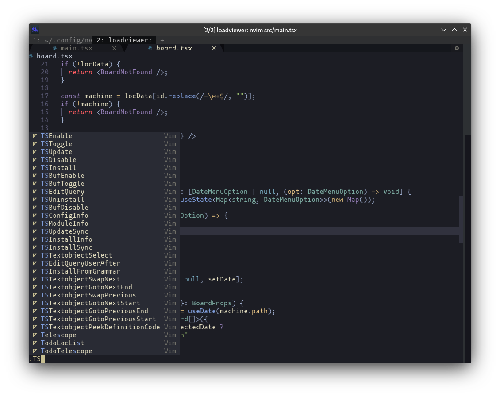

<h1 align="center">My Neovim Configuration</h1>


## Features

* ***Fast*** and ***Lazy***: It takes [28ms](./fixtures/benchmark.txt) in average to open the neovim editor.
And every plugin is handled well to be activate only when they are needed.
Nothing should slowdown the editor.
* ***Handy*** and ***Smoothy***: There will always be a panel to remind you
when you forget your key settings. There will always be a short keystroke to help
you get to the place you want to jump to. There will always…
* ***Powerful*** coding experience: With the power from nvim-lspconfig, we can
have "IDE Level" coding experience in the terminal.
* ***Fancy looking***: Talk is cheap, see the [gallery](#Gallery).

## Getting Start

You can press the fork button to clone my project (Don't forget
to smash the star button! `:)`), then pull your repo to the local:

This configuration is compatible with neovim 0.7+, the latest stable version.
And consider using the latest stable release. I will push some experimental changes to
the master branch, and they may be reverted.

```bash
# You can fork and use git to download source code
git clone --depth=1 https://github.com/Avimitin/nvim.git ~/.config/nvim
# Then switch to the latest stable version
git checkout latest

# Or You can just download the latest stable version (Auto Retagged)
curl "https://github.com/Avimitin/nvim/blob/master/scripts/install.bash" -o install.bash
# Please read the script before you use it
cat install.bash
# Execute it
bash install.bash
```

Finally, input `nvim` to open the editor, and all plugins will be downloaded automatically.

```bash
nvim
```

You can read the full installation instruction here:
[**==> Installation Guide**](https://avimitin.github.io/nvim/en_us/installation.html)

## Document

Please read [**NVIM GUIDANCE**](https://avimitin.github.io/nvim).

## Gallery

<details>
    <summary markdown="span">Utilities</summary>

| Easy in-file jump                             |
| --------------------------------------------- |
|    |

| Which key?                                    |
|-----------------------------------------------|
|  |

</details>


<details>
    <summary markdown="span">Markdown Utils</summary>

| Markdown Preview                                   |
|----------------------------------------------------|
|               |

| Table                                              |
|----------------------------------------------------|
|  |

</details>


<details>
    <summary markdown="span">Coding Utils</summary>

| Diagnostic Panel |
|-----------------|
|   |

| Code Completion                       |
|---------------------------------------|
|  |

| Command Completion                                 |
|----------------------------------------------------|
|  |

| Inline diagnostic analytics |
|-----------------------------|
|  |

| Signature Help                       |
|--------------------------------------|
|  |

| Code Actions                                    |
|-------------------------------------------------|
|  |

| Diagnostic                                      |
|-------------------------------------------------|
|  |

| Debug CPP                               |
|-----------------------------------------|
|  |

| Debug Rust                                |
|-------------------------------------------|
|  |

| Code navigate                          |
|----------------------------------------|
|  |

| Project grep                                        |
|-----------------------------------------------------|
|  |

| Symbol search                                   |
|-------------------------------------------------|
|  |

</details>

<details>
    <summary markdown="span">File Manage</summary>


| File Manager                        |
|-------------------------------------|
|  |

| nvim-tree                                 |
|-------------------------------------------|
|  |

| Find file                                           |
|-----------------------------------------------------|
|  |

</details>

<details>
    <summary markdown="span">Git Helper</summary>

| Fugitive                                       |
|------------------------------------------------|
|  |

| Lazygit                                      |
|----------------------------------------------|
|  |

</details>


<details>
    <summary markdown="span">Themes</summary>

| Kanagawa Theme                          |
|-----------------------------------------|
|  |

| Deus Theme                           |
| ------------------------------------ |
|   |

| GitHub Light Theme                                                                                                                                                        |
|---------------------------------------------------------------------------------------------------------------------------------------------------------------------------|
| 

</details>

## License

This configuration since commit `912416ae9c4b55501b23a91d774b567ba8697dd1` are
licenced under the Apache 2.0 license.

另附：禁止在 CSDN，bilibili 等国内平台使用该配置文件进行任何活动。
你只保有自己修改部分的权利。

## Credit

The v1.0-vimscript version is originally inspired by
[theniceboy/nvim](https://github.com/theniceboy/nvim). And lua code since v2.0 is inspired by
[siduck76/NvChad](https://github.com/siduck76/NvChad).

Take a look at their contribution, which is really fantastic.

## Development Related

Please read [development specifications](./docs/src/en_us/development.md).

<br/>

---

<br/>
<br/>
<br/>
<br/>

<sup>有不少朋友问我翻斗花园是什么花园呢？其实就是大耳朵图图的家啦！</sup>
<sup><s>
我的 neovim 配置是翻斗花园第一配置，不服来打，我家住在翻斗大街翻斗花园2号楼1001室。
我爸胡英俊，我妈张小丽，我叫胡图图，你来你看我干不干你就完事儿了。
</s></sup>
