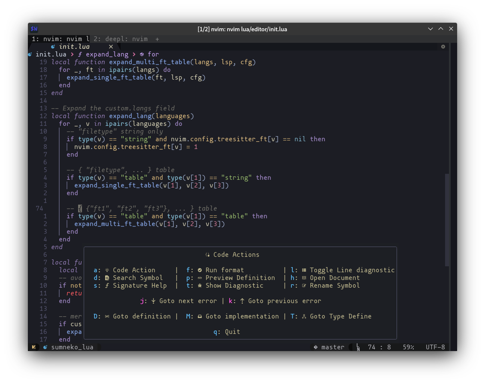

<!-- vim-markdown-toc GFM -->

* [Coding](#coding)
  * [Sources](#sources)
  * [lspconfig](#lspconfig)
    * [Files](#files)
    * [Keymaps](#keymaps)
    * [How to add new lsp server](#how-to-add-new-lsp-server)
* [Completion](#completion)
  * [Configuration](#configuration)
  * [Sources](#sources-1)
  * [Reference](#reference)
* [Enhance](#enhance)
  * [How to interact with files](#how-to-interact-with-files)
    * [#1 Nvim-tree plugin](#1-nvim-tree-plugin)
      * [Keymap](#keymap)
    * [#2 Telescope Fuzzy Find](#2-telescope-fuzzy-find)
      * [Keymap](#keymap-1)
    * [#3 nvim-cmp completion](#3-nvim-cmp-completion)
  * [How to use multi-cursor](#how-to-use-multi-cursor)
    * [Select multiple lines in same column.](#select-multiple-lines-in-same-column)
    * [Select same word.](#select-same-word)
    * [Use regex to select](#use-regex-to-select)
    * [Add visual select region to multiple cursor](#add-visual-select-region-to-multiple-cursor)
    * [How to unselect a matches](#how-to-unselect-a-matches)
  * [nvim-bufferline.lua](#nvim-bufferlinelua)
    * [keymap](#keymap-2)
  * [sort.nvim](#sortnvim)
  * [splitjoin](#splitjoin)
    * [Usage](#usage)
  * [vim-surround](#vim-surround)
    * [Keymap](#keymap-3)
  * [telescope.nvim](#telescopenvim)
    * [Key mappings](#key-mappings)
  * [wildfire](#wildfire)
    * [Usage](#usage-1)
    * [Configuration](#configuration-1)
  * [Create new split window](#create-new-split-window)
  * [Navigate between window](#navigate-between-window)
  * [Move window](#move-window)
  * [Auto resize window](#auto-resize-window)
* [git.lua](#gitlua)
  * [Workflow 1: The git status panel](#workflow-1-the-git-status-panel)
  * [Workflow 2: Save by key mappings](#workflow-2-save-by-key-mappings)
  * [Other available key mappings](#other-available-key-mappings)
* [Packer](#packer)
  * [Basic](#basic)
  * [Rc?](#rc)
  * [Commands](#commands)
  * [Add new plugin](#add-new-plugin)
  * [Delete plugins](#delete-plugins)
  * [Useful fields](#useful-fields)
  * [Lazyload settings](#lazyload-settings)
  * [FAQ](#faq)
    * [How to set up options **before** plugin load?](#how-to-set-up-options-before-plugin-load)
    * [How to setup config **after** plugin load?](#how-to-setup-config-after-plugin-load)
    * [How to load plugin only when you called it's command](#how-to-load-plugin-only-when-you-called-its-command)
    * [How to load plugin only in specific filetype](#how-to-load-plugin-only-in-specific-filetype)
    * [How to load plugin for specific module call](#how-to-load-plugin-for-specific-module-call)
* [Colors](#colors)
  * [Config path](#config-path)
  * [Change the theme](#change-the-theme)
  * [Extra](#extra)
  * [Gallery](#gallery)
  * [Add your theme](#add-your-theme)

<!-- vim-markdown-toc -->

# Coding

## Sources

* [jose-elias-alvarez/null-ls.nvim](https://github.com/jose-elias-alvarez/null-ls.nvim)
  > Inject other non-lsp sources into LSP. In my configuration, I use it to help me replace the default Lua
  > formatter with stylua, and inject eslint with tsserver.
* [folke/trouble.nvim](https://github.com/folke/trouble.nvim)
  > Pretty the diagnostic panel, press `gq` to see what it is.
* [nvim-treesitter/nvim-treesitter](https://github.com/nvim-treesitter/nvim-treesitter)
  > Generate text-object base on syntax. Useful for highlighting and text operation
* [nvim-treesitter/nvim-treesitter-textobjects](https://github.com/nvim-treesitter/nvim-treesitter-textobjects)
  > Create text object
* [windwp/nvim-ts-autotag](https://github.com/windwp/nvim-ts-autotag)
  > Automatically insert/update HTML fragment.
* [neovim/nvim-lspconfig](https://github.com/neovim/nvim-lspconfig)
  > Integrate the LSP program with neovim built-in LSP functionality.
  >
  > [Details document](./lspconfig.md)
* [glepnir/lspsaga.nvim](https://github.com/glepnir/lspsaga.nvim)
  > Pretty all the LSP stuff. Like winbar, rename panel, code action panel......
* [simrat39/rust-tools.nvim](https://github.com/simrat39/rust-tools.nvim)
  > Enhance the Rust coding experience
* [saecki/crates.nvim](https://github.com/saecki/crates.nvim)
  > Add completion, code actions for Cargo.toml.
* [mfussenegger/nvim-dap](https://github.com/mfussenegger/nvim-dap)
  > Code debugger
* [rcarriga/nvim-dap-ui](https://github.com/rcarriga/nvim-dap-ui)
  > Add UI for the nvim-dap
* [simrat39/symbols-outline.nvim](https://github.com/simrat39/symbols-outline.nvim)
  > Add symbols quick jump panel, use `:SymbolOutline` to toggle.
* [numToStr/Comment.nvim](https://github.com/numToStr/Comment.nvim)
  > Quickly comment line or block of code. Use `gcc` to comment line, `gcb` to comment block.
* [tpope/vim-dispatch](https://github.com/tpope/vim-dispatch)
  > Async command execute. Use `;d` to toggle it.
* [j-hui/fidget.nvim](https://github.com/j-hui/fidget.nvim)
  > Show the lsp program loading status at bottom-right.
* [zbirenbaum/neodim](https://github.com/zbirenbaum/neodim)
  > Dim the color of the unused variable/function...

## lspconfig

The lspconfig integrate the Microsoft Language Server Protocol into
neovim, so you can have syntax check while coding.

### Files

The configuration for lspconfig is put into the `lua/overlays/rc/lspconfig.lua`.

### Keymaps

To separate the normal key mappings and code key mappings, key mappings are attach
to buffer when launching LSP server. Those key mappings are set in
`lua/overlays/rc/lspconfig_keymap.lua` file.

All the lsp key mappings can be trigger by `;a`:



* Addtional keymappings

| keys              | map                                                      |
|-------------------|----------------------------------------------------------|
| <kbd>Ctrl u</kbd> | Scoll up document                                        |
| <kbd>Ctrl d</kbd> | Scroll down document                                     |

### How to add new lsp server

Modify the `init.lua` file. Add a pair inside the `langs` field in this form:
`{ "filetype", "server name" }`. You can check filetype by using command `echo &filetype`.

- Example:

```lua
-- file: lua/custom.lua
local coding = {
  langs = {
    { {"c", "cpp"}, "clangd" },
    { "go", "gopls" },
    { {"javascript", "typescript"}, "eslint" },
    { "python", "pyright" },
  }
}

return custom
```

Install the server by your system package manager, and add the executable name
into the custom.lua file.

> * Rust server is automatically installed and set up by rust-tools.nvim.
> Don't add the rust-analyzer executable here.

# Completion

## Configuration

The nvim-cmp is configured to use nerdfont to show icons. You will need a patched
nerd font: <https://www.nerdfonts.com/>.

I also enabled the ghost text feature so you can always get inline hint.
For those who don't like this feature, you can close this by updating the
ghost_text variable:

```lua
experimental = {
  ghost_text = false
}
```

## Sources

Below are the available sources:

* [rafamadriz/friendly-snippets](https://github.com/rafamadriz/friendly-snippets)
  > Community contributed coding snippets
* [hrsh7th/nvim-cmp](https://github.com/hrsh7th/nvim-cmp)
  > Core of the completion engine
* [hrsh7th/cmp-path](https://github.com/hrsh7th/cmp-path)
  > Complete the filesystem path
* [hrsh7th/cmp-nvim-lsp](https://github.com/hrsh7th/cmp-nvim-lsp)
  > Complete the LSP symbol
* [hrsh7th/cmp-nvim-lsp-signature-help](https://github.com/hrsh7th/cmp-nvim-lsp-signature-help)
  > Complete the LSP signature
* [hrsh7th/cmp-buffer](https://github.com/hrsh7th/cmp-buffer)
  > Complete the word in current buffer
* [hrsh7th/cmp-vsnip](https://github.com/hrsh7th/cmp-vsnip)
  > Complete with snippets
* [hrsh7th/vim-vsnip](https://github.com/hrsh7th/vim-vsnip)
  > Core of the snippet engine
* [hrsh7th/cmp-cmdline](https://github.com/hrsh7th/cmp-cmdline)
  > Complete the vim command
* [uga-rosa/cmp-dictionary](https://github.com/uga-rosa/cmp-dictionary)
  > Complete vocabulary
* [hrsh7th/cmp-nvim-lsp-document-symbol](https://github.com/hrsh7th/cmp-nvim-lsp-document-symbol)
  > Complete when searching symbols

## Reference

- `:h nvim-cmp`
- `:h vsnip`

# Enhance

* [folke/which-key.nvim](https://github.com/folke/which-key.nvim)
  > Display cheatsheets for keys
* [simnalamburt/vim-mundo](https://github.com/simnalamburt/vim-mundo)
  > Show undo history, use command `:Mundo` to toggle it
* [sindrets/winshift.nvim](https://github.com/sindrets/winshift.nvim)
  > Toggle window switch mode. Use command `:WinShift` to toggle.
* [kyazdani42/nvim-web-devicons](https://github.com/kyazdani42/nvim-web-devicons)
  > Nerd font icons library
* [glepnir/galaxyline.nvim](https://github.com/glepnir/galaxyline.nvim)
  > Status line library
* [akinsho/nvim-bufferline.lua](https://github.com/akinsho/nvim-bufferline.lua)
  > Show buffer as tab at the top, use `<TAB>` to forward, use `<Shift-TAB>` to backward.
* [kyazdani42/nvim-tree.lua](https://github.com/kyazdani42/nvim-tree.lua)
  > Tree-like file manager, use `;t` to toggle.
* [akinsho/toggleterm.nvim](https://github.com/akinsho/toggleterm.nvim)
  > Enhanced neovim terminal, use `_` to open it. Use number +`_` to toggle different terminal.
  > For example, press `2_` to open the second terminal.
* [uga-rosa/ccc.nvim](https://github.com/uga-rosa/ccc.nvim)
  > Color picker and highlighter, useful for frontend developer
* [mg979/vim-visual-multi](https://github.com/mg979/vim-visual-multi)
  > Multiple cursor.
* [glepnir/dashboard-nvim](https://github.com/glepnir/dashboard-nvim)
  > Add a start page when user open editor only.
* [notjedi/nvim-rooter.lua](https://github.com/notjedi/nvim-rooter.lua)
  > Find the root directory of the current file and change dir into it.
  > It use `.git`, `packages.json`, `Cargo.toml` as root dir pattern.
* [nvim-telescope/telescope.nvim](https://github.com/nvim-telescope/telescope.nvim)
  > Fuzzy search text and file. Use `;f` to search file, use `;s` to search text.
* [gcmt/wildfire.vim](https://github.com/gcmt/wildfire.vim)
  > Quick select text object by `<Enter>` key.
* [tpope/vim-surround](https://github.com/tpope/vim-surround)
  > Quickly add character surround the selected text, see its readme for usage.
* [junegunn/vim-easy-align](https://github.com/junegunn/vim-easy-align)
  > Plugin to align text, use `<LEADER>e` to toggle it. See its readme for usage.
* [ggandor/lightspeed.nvim](https://github.com/ggandor/lightspeed.nvim)
  > Quickly hop inside buffer. Use `s/S`, `f/F`, `t/T` to toggle it.
* [andymass/vim-matchup](https://github.com/andymass/vim-matchup)
  > Hop between pair, use `,` to jump.
* [windwp/nvim-autopairs](https://github.com/windwp/nvim-autopairs)
  > Automatically add pairs of your brackets.
* [AndrewRadev/splitjoin.vim](https://github.com/AndrewRadev/splitjoin.vim)
  > Enhance the split line functionality, use `gS` to split single line to multiple line base on syntax.
* [lukas-reineke/indent-blankline.nvim](https://github.com/lukas-reineke/indent-blankline.nvim)
  > Add indent guide line
* [sQVe/sort.nvim](https://github.com/sQVe/sort.nvim)
  > Sort the text based on pattern. Use command `:Sort` to enable it
* [karb94/neoscroll.nvim](https://github.com/karb94/neoscroll.nvim)
  > Add smoothy animation for srolling. `<Ctrl-j>`, `Ctrl-k` `Ctrl-u` `Ctrl-d` `Ctrl-f` `Ctrl-b`
* [windwp/nvim-spectre](https://github.com/windwp/nvim-spectre)
  > Search and replace text. Use `SpectreOpen` to toggle it
* [beauwilliams/focus.nvim](https://github.com/beauwilliams/focus.nvim)
  > Automatically enlarge window when focus
* [rcarriga/nvim-notify](https://github.com/rcarriga/nvim-notify)
  > Add beautiful UI and animation for notification
* [tpope/vim-repeat](https://github.com/tpope/vim-repeat)
  > Use `.` to repeat your last operation
* [monaqa/dial.nvim](https://github.com/monaqa/dial.nvim)
  > Use `-` and `=` to decrease/increase date/number/boolean
* [petertriho/nvim-scrollbar](https://github.com/petertriho/nvim-scrollbar)
  > Add scrollbar for your buffer
* [kevinhwang91/nvim-hlslens](https://github.com/kevinhwang91/nvim-hlslens)
  > Enhance the search experience
* [tpope/vim-sleuth](https://github.com/tpope/vim-sleuth)
  > Automatically setup indent, space/tab base on current project.
* [lewis6991/impatient.nvim](https://github.com/lewis6991/impatient.nvim)
  > Buffer everything

## How to interact with files

There are multiple plugin that can help you find and edit a file.

### #1 Nvim-tree plugin

Nvim-tree.lua is a plugin that show files in tree view.
The configuration is located in `lua/plugins/modules/enhance/config/nvim-tree.lua`


#### Keymap

* Use <kbd>;t</kbd> to toggle the tree view.
* Press <kbd>R</kbd> to refresh the file tree.
* Press `?` inside the nvim-tree to get list of keymap.

### #2 Telescope Fuzzy Find

Telescope support fuzzy find file like what fzf did.


#### Keymap

* Press <kbd>;f</kbd> to open fuzzy find file.

### #3 nvim-cmp completion

nvim-cmp can fuzzy complete file path too! Press `:` into command line, then input
file path to trigger completion.

## How to use multi-cursor

I don't enable all the functionality in vim-visual-multi plugins.
Features that I kept are all inspired by
[helix-editor](https://helix-editor.com/) and [Kakoune](https://kakoune.org/):
multiple select and manipulation by words and regex.

### Select multiple lines in same column.

Use <kbd>Ctrl up/down</kbd> to create multiple cursor vertically.

### Select same word.

Use <kbd>un</kbd> to select word under cursor, then press <kbd>n</kbd> to select more.

You can also use <kbd>uA</kbd> to select all the same words at once.

### Use regex to select

Use <kbd>ux</kbd> to enable regex search. Input the regex match and press enter to confirm.
Then use <kbd>n</kbd> to select forward, use <kbd>N</kbd> to select backward.

The key <kbd>ux</kbd> is also usable in visual mode. You can use <kbd>V</kbd> to select a region
and then press <kbd>ux</kbd> to regex select region. Just like the Kakoune editor style.

### Add visual select region to multiple cursor

You can use `v` to enter visual select, then press <kbd>ua</kbd> to add the visual select
region.

### How to unselect a matches

You can use <kbd>]</kbd> to select forward, and <kbd>[</kbd> to select backward. Then use
<kbd>Q</kbd> to unselect the matches under cursor.

<sub>More documents: <a href="https://github.com/mg979/vim-visual-multi/wiki/Mappings">vim-visual-multi wiki</a></sub>

## nvim-bufferline.lua

nvim-bufferline.lua is a buffer manager. It looks like tab page, but it can
manage more than tab page.


### keymap

* Use <kbd>Tab</kbd> to go to next page.
* Use <kbd>Shift Tab</kbd> to go to previous page.
* Use <kbd>Ctrl-c</kbd> to open picker mode and close the buffer.
* Use <kbd>;p</kbd> to pick buffer.


## sort.nvim

Use command `:Sort` in visual or normal mode.

<video src="https://user-images.githubusercontent.com/2284724/145567686-3b52978c-58fe-4f32-ad27-c2b1060870ba.mp4" controls>
</video>

## splitjoin


### Usage

Press `gS` to split multiple line.
Press `gJ` to join multiple line.

## vim-surround

Vim-surround can help you manage the surrounding text easily.

### Keymap

| keymap | functionality                    |
|--------|----------------------------------|
| cs     | Change surround text             |
| ds     | Delete surround text             |
| gs     | Add surround text in visual mode |
| ys     | add surround text in normal mode |

## telescope.nvim

Telescope is a powerful fuzzy search and pick plugin.
It works like `fzf`, but more extensible.

### Key mappings

* <kbd>;f</kbd> to open fuzzy file finder


* <kbd>;s</kbd> to open grep/symbol search finder


* Use command `:Telescope` to see other useful builtin finder

## wildfire

The wildfire plugin can help you select text object on fly.

### Usage

Press <kbd>Enter</kbd> in
`""`, `()`, `{}`, `[]`, `''`, <code>\`\`</code>, `<tag></tag>`.
And this plugin will automatically select text inside this surrounding signs.

### Configuration

The configuration is defined in lua/overlays/rc/init.lua.
You can modify the `vim.g.wildfire_objects` variable.

You can add the bracket you want inside it.
For example, assuming that you want to select text inside the `$$` on fly,
you can append `"i$"` into the list.

## Create new split window

In nvim tree, you can press <kbd>Ctrl v</kbd> to create a vertical split window.
And press <kbd>Ctrl h</kbd> to create horizon split window.

This keymap is as same as the telescope.

## Navigate between window

You can use `<ctrl-w>` + `h/j/k/l` to move arround the windows.

## Move window

Some time you may want to move the left panel to right panel or else.
There is a plugin [winshift.nvim](https://github.com/sindrets/winshift.nvim)
can help you do this thing.


Press command `:WinShift` to trigger windows move mode, then just use `hjkl` to
move the window.

## Auto resize window

I've add a [focus.nvim](https://github.com/beauwilliams/focus.nvim) plugin to help
auto resizing the windows.


The auto resize mode will be trigger when you open any new windows.
You don't need to do anything.

This is powered by vim `WinEnter` command. This event is happened when you entering
***another*** window, which means that it will not be trigger when you first open the
neovim.

This plugin provides `:FocusSplitNicely` command to help you create tiled windows layout.
You should input this command twice to get the below layout.

```text
+----------------+------------+
|                |    S1      |
|                |            |
|                +------------+
|                |            |
|   MAIN PANE    |    S2      |
|                |            |
|                |            |
|                |            |
+----------------+------------+
```

# git.lua


There are some plugins that helps you interact with git.
Most of the git key mappings are prefixed by `gi`, you can
use just press and wait for the key panel prompt to get a hint.

- vim-fugitive

This is a wrapper plugin for git.
You can use all the git CLI command in vim like it is in the terminal.
For example, to run command `git rebase -i HEAD~2`,
you can use `:Git rebase -i HEAD~2`.

See the full list of command in its readme file:
<https://github.com/tpope/vim-fugitive>.

- gitsigns.nvim

This plugin can add sign column on the left to highlight the changes.
And it gives functionality to do some git work like stage hunks, reset changes,
preview change, git blame...etc.

You can update gitsigns configuration in `lua/plugins/config/gitsigns_cfg.lua` file.

## Workflow 1: The git status panel

The fugitive plugin provides a command `;g` to open a magit like panel.


You can stage file with key `s`, commit file with key `cc`, view inline
diff with key `=`, jump between file with key `)(`. There are also rebase
key mappings, amend mappings...etc.

And the `:G` command is now mapped with key `;g`.

You can see full list of the keys definition with key `g?`.

## Workflow 2: Save by key mappings

I map the key `gic` to run command `:Git commit -sS`, and key `giP` to
open the command line with `:Git! push ` input already.[^1]

This built a new workflow: 

1. You can stage current hunk[^2] with key `gis`.
2. You can view the diff page by keymap `gid`.
3. Then just run `gic` to open commit panel.
4. Finally click `giP` and input the remote and branch to push.

[^1]: The bang sign `!` here means run the `git push` command in the
background.

[^2]: The "hunk" word means a range of the changes. It is highlighted by
the icon on the left.

## Other available key mappings

| key mappings   | functionality            |
|----------------|--------------------------|
| <kbd>gij</kbd> | Jump to next hunk        |
| <kbd>gik</kbd> | Jump to prev hunk        |
| <kbd>gis</kbd> | Stage current hunk       |
| <kbd>giS</kbd> | Stage current buffer     |
| <kbd>gir</kbd> | Reset current hunk       |
| <kbd>giR</kbd> | Reset the buffer         |
| <kbd>giu</kbd> | Undo stage               |
| <kbd>gip</kbd> | Preview changes          |
| <kbd>gib</kbd> | Toggle inline blame      |
| <kbd>giB</kbd> | Toggle full page blame   |
| <kbd>gid</kbd> | Open diff pages          |
| <kbd>giD</kbd> | Open diff with ~ as base |
| <kbd>gih</kbd> | Toggle deleted line      |
| <kbd>gic</kbd> | Open commit panel        |
| <kbd>giP</kbd> | Git push                 |
| <kbd>;g</kbd>  | Open git status          |

# Packer

Packer is a plugin manager. It will download plugins from GitHub
and add plugin into runtime path automatically. What it differ to other
is that it can lazyload plugins easily.

Here I will describe some usage and give some useful tips.
For more details please read the packer.nvim README file:
https://github.com/wbthomason/packer.nvim

## Basic

The packer plugin is initialized in the `lua/overlays/init.lua` file.

## Rc?

In my configuration, you will see the `rc` field is laying around the repos metadata,
but packer doesn't provide the key. So what it is?

It is a custom handler I inject into packer. It will read the value and load the corresponding
module under the `overlays/rc` directory, and load the setup function defined in `lua/overlays/rc/_setups.lua`.
It's safe to add this field because the handler will validate the value. So you don't need to
worry that you have only one stuff to configure.

For example, assuming I have a file with path `~/.config/nvim/lua/overlays/rc/example.lua`,
then after I add `rc = "example"` into repo metadata, it will automatically load it:

```lua
{
  "xxx/repo",
  rc = "example"
}

-- is equivalent to
{
  "xxx/repo",
  config = function()
    if module_exist(...) then
      require("overlays.rc.example")
    end
  end,
  setup = function()
    local setup = require("overlays.rc._setups")
    if setup["example"] ~= nil then
      setup["example"]()
    end
  end
}
```

## Commands

* `:PackerInstall`: Run install process when you import new plugin.
* `:PackerClean`: Remove local plugins which is not in the plugin list.
* `:PackerUpdate`: Update all the plugin in the plugin list.
* `:PackerSync`: Run all the above command in one.

## Add new plugin

If you want to add a plugin from GitHub, you can add new plugin metadata into corresbonding
plugin file.

For example, if you want to add the plugin `trouble.nvim`, and it's URL is
<https://github.com/folke/trouble.nvim>. As it is a coding related plugin,
so we add it into the `overlays/coding.lua` file.

```lua
local repos = {
  -- ...
  {  'folke/trouble.nvim' }
  -- ...
}

return repos
```

After saving the file, run command `:PackerInstall` to install the plugin.

## Delete plugins

You just need to delete the declaration line, then run `:PackerClean`.

## Useful fields

This is the key to make your neovim faster.

| fields      | value                        | usage                                                                         |
| ----------- | ---------------------------- | ----------------------------------------------------------------------        |
| disable     | boolean                      | Mark a plugin as inactive                                                     |
| as          | string                       | Specifies an alias under which to install the plugin                          |
| installer   | function                     | Specifies custom installer. See "custom installers" below.                    |
| updater     | function                     | Specifies custom updater. See "custom installers" below.                      |
| after       | string or list               | Specifies plugins to load before this plugin. See "sequencing" below          |
| rtp         | string                       | Specifies a subdirectory of the plugin to add to runtimepath.                 |
| opt         | boolean                      | Manually marks a plugin as optional.                                          |
| branch      | string                       | Specifies a git branch to use                                                 |
| tag         | string                       | Specifies a git tag to use                                                    |
| commit      | string                       | Specifies a git commit to use                                                 |
| lock        | boolean                      | Skip updating this plugin in updates/syncs. Still cleans.                     |
| run         | string, function, or table   | Post-update/install hook. See "update/install hooks".                         |
| requires    | string or list               | Specifies plugin dependencies. **Plugin in requires list can't be lazyload.** |
| rocks       | string or list               | Specifies Luarocks dependencies for the plugin                                |
| config      | string or function           | Specifies code to run after this plugin is loaded.                            |

## Lazyload settings

| fields         | value              | usage                                                                                                                                          |
|----------------|--------------------|------------------------------------------------------------------------------------------------------------------------------------------------|
| setup          | string or function | pecifies code to run before this plugin is loaded.                                                                                             |
| cmd            | string or list     | Specifies commands which load this plgin. Can be an autocmd pattern.                                                                           |
| ft             | string or list     | Specifies filetypes which load this plugin.                                                                                                    |
| key            | string or list     | Specifies maps which load this plugin. See "Keybindings".                                                                                      |
| event          | string or list     | Specifies autocommand events which load this plugin.                                                                                           |
| fn             | string or list     | Specifies functions which load this plugin.                                                                                                    |
| cond           | str/func/list of str/func   | Specifies a conditional test to load this plugin                                                                                      |
| module         | string or list     | Specifies Lua module names for require. When requiring a string which starts with one of these module names, the plugin will be loaded.        |
| module_pattern | string/list        | Specifies Lua pattern of Lua module names for require. When requiring a string which matches one of these patterns, the plugin will be loaded. |

## FAQ

### How to set up options **before** plugin load?

Use the setup field. Example config:

```lua
use {
  'path/to/plugin',
  setup = function()
    -- this function will be called before the plugin loaded
    vim.g.settings = "your settings"
  end
}
```

### How to setup config **after** plugin load?

Use the config field. Example config:

```lua
use {
  'plugin',
  config = function()
    require('plugin').setup{}
  end
}
```

### How to load plugin only when you called it's command

For example, the vim-fugitive provide command `:Git`, you can load the
vim-fugitive command only when you call the Git command:

```lua
use {
  'tpope/vim-fugitive',
  cmd = {
    'G', 'Git',
    'Ggrep',
    'Gdiffsplit',
    'GBrowse'
  }
}
```

With the above settings, vim-fugitive will not be sourced when you open the
editor. It will only be sourced after you called the
`:G/:Git/:Ggrep/:Gdiffsplit/:GBrowse` command.

### How to load plugin only in specific filetype

In the below example, nvim-lsp-installer will only be loaded when you open file
with `.json`, `.py`, and `.js` extension.

```lua
use {
  'williamboman/nvim-lsp-installer',
  ft = { "json", "python", "javascript" },
  config = function()
    require("lspconfig")
  end
}
```

> **Important notes**:
>
> The ft field has more priviledge than the after field.
> So if you have `ft` and `after` for same plugin, it will first evaluate the
> filetype not the after field.

### How to load plugin for specific module call

The telescope.nvim here will only be loaded after any code call the
`require("telescope")`.

```lua
use {
  'nvim-telescope/telescope.nvim',
  requires = {
    'nvim-lua/popup.nvim',
    'nvim-lua/plenary.nvim'
  },
  config = function()
    require("config.telescope_config")
  end,
  module = 'telescope'
}
```

# Colors

This section describe how I manage the colorscheme.

## Config path

```text
lua/overlays/theme.lua
```

## Change the theme

This configuration has "kanagawa" as the default colorscheme value.
If you want to change the default value, you can modify the `theme` field in `init.lua` file.

```lua
require('editor').setup({
  ui = {
    theme = "kanagawa" -- <- modify this one
  }
})
```

## Extra

Additionally, with this custom script file, you can switch day and night theme
automatically.

Example script:

```lua
require('editor').setup({
  ui = {
    theme = "kanagawa" -- <- Leave this unchange
    -- Here setup night mode duration with format "Hour:Min"
    darkmode = {
      enable = true,
      day = "github_light" -- <- any of the light colorscheme
      night = "deus" -- <- any of the dark colorscheme
      night_time = {
        begin = "19:00",
        end   = "7:00",
      }
    }
  }
})
```

## Gallery

* deus

```lua
theme = "deus"
```


* kanagawa 

```lua
theme = "kanagawa"
```


* GitHub

```lua
theme = "github_dark" or "github_light"
```


## Add your theme

If you want to add a new theme, follow the below instruction.

1. Add the theme plugin in the `lua/overlays/theme.lua`.

Assuming that the name of your theme call "nord".

```lua
{
  'somebody/nord',
  -- load theme plugin only when we use it
  cond = function()
    return vim.g.nvcfg.ui.theme == "nord"
  end,
  rc = "nord",
}
```

2. Add the configuration

Create a file under directory `lua/overlays/rc/` and named it `nord.lua`

```lua
-- lua/overlays/rc/nord.lua

require("nord").setup({
    -- ...
})
```
